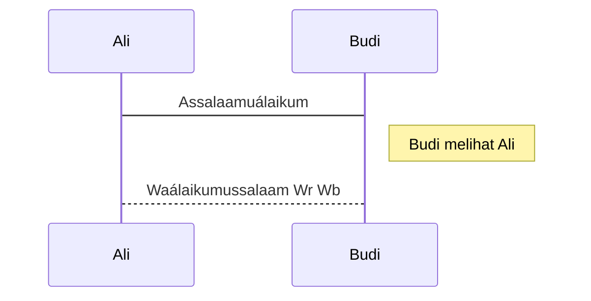
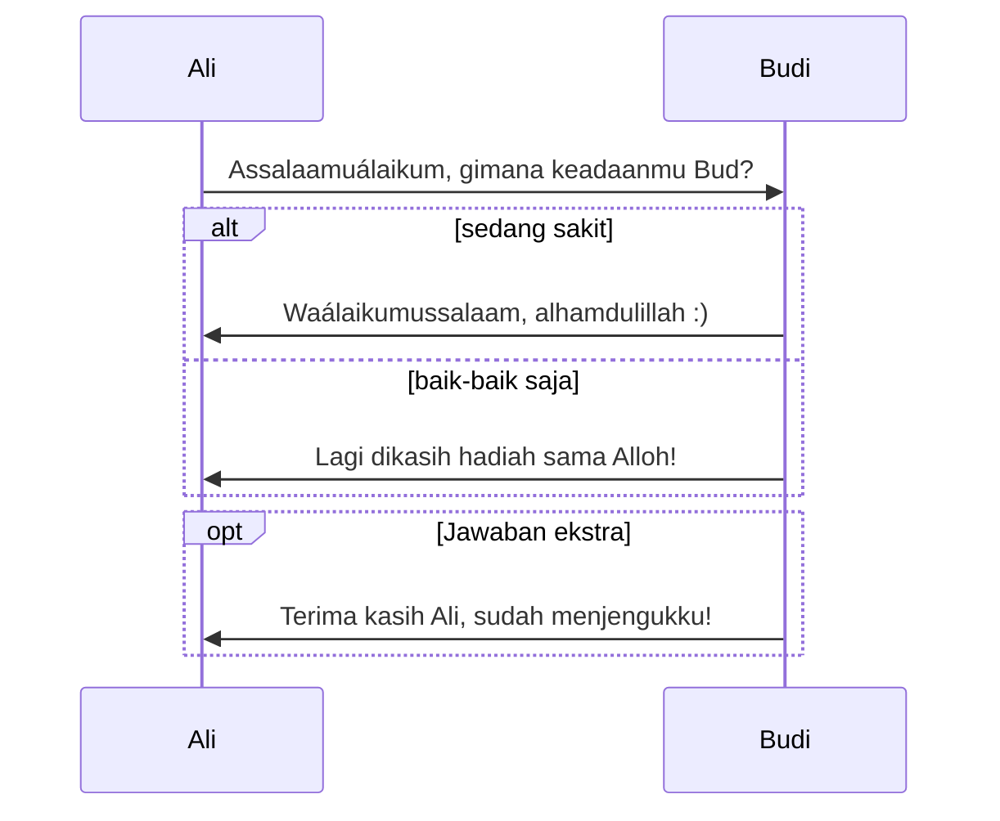
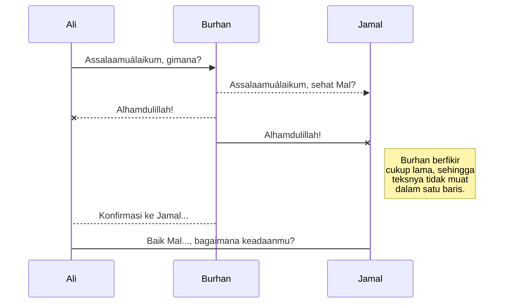
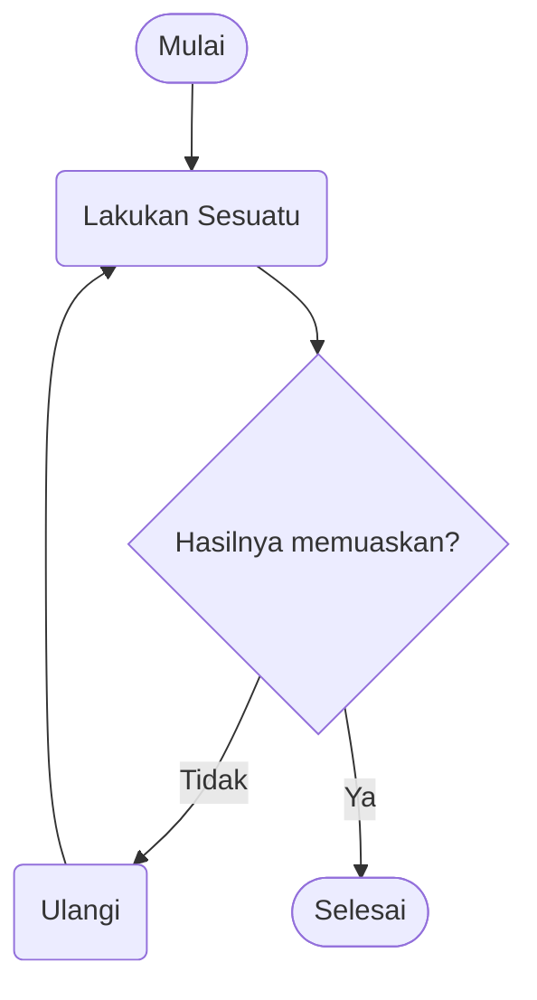
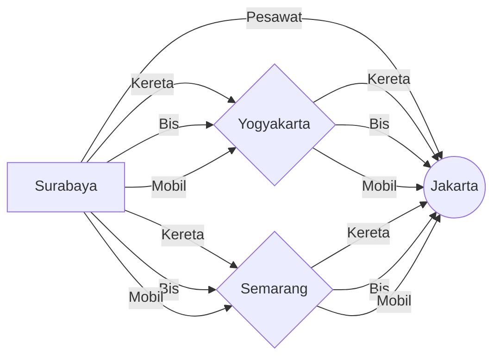
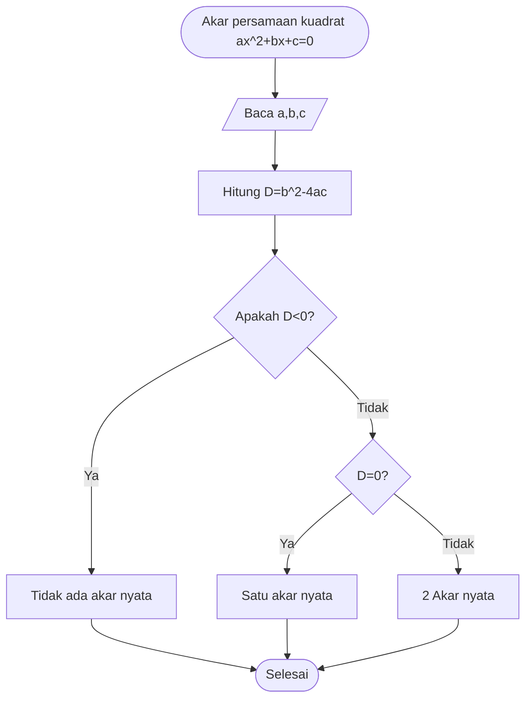
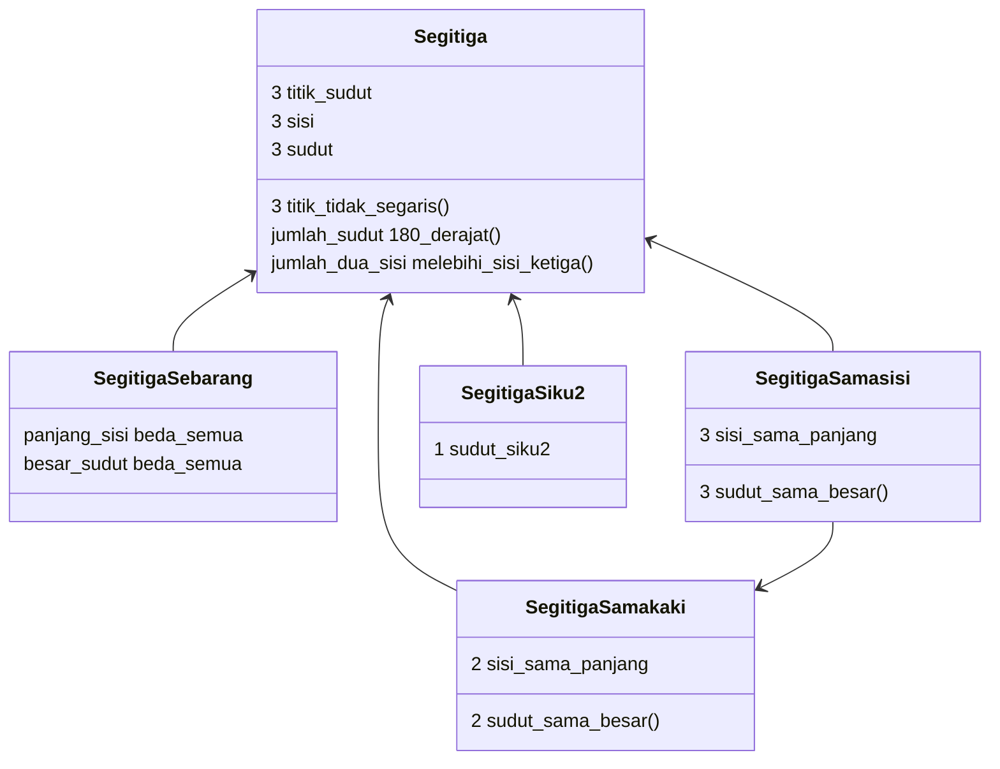
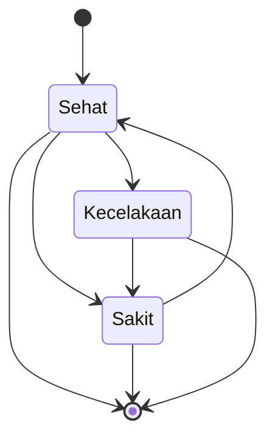
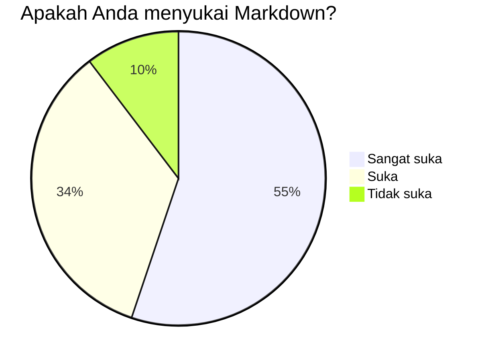
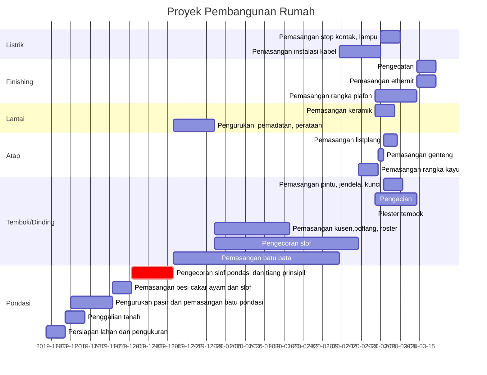

**Sahid**<br>
**Jurusan Pendidikan Matematika, FMIPA, UNY**<br>
*[sahid@uny.ac.id](mailto:sahid@uny.ac.id), [sahidyk@gmail.com](mailto:sahidyk@gmail.com)*



## Pendahuluan: Apakah Markdown?

**Markdown** adalah bahasa *markup* sederhana yang dapat digunakan untuk menambahkan elemen-elemen pemformatan teks dan elemen-elemen lain pada dokumen. Markdown dibuat oleh [John Gruber](https://daringfireball.net/projects/markdown/), dibantu Aaron Swartz, pada tahun 2004, dan sekarang menjadi salah satu bahasa markup paling populer di dunia. Tujuan utama Markdown adalah untuk memudahkan orang menulis dokumen menggunakan teks biasa yang mudah dibaca, yang dapat dikonversi menjadi dokumen HMTL. Gruber menulis program Markdown dalam bentuk skrip bahasa Perl **Markdown.pl** yang berfungsi mengubah file teks bertanda khusus menjadi file HTML yang sahih dan bersih.

Menggunakan Markdown secara umum berbeda dengan menggunakan editor **WYSIWYG** (*What You See Is What You Get*, **Yang Anda lihat di layar adalah yang Anda lihat di kertas**). Pada aplikasi seperti Microsoft Word, Anda mengklik tombol/ikon/menu/submenu untuk memformat huruf, kata, frasa, kalimat, paragraf, dan perubahannya langsung terlihat. Markdown tidak seperti itu. Saat Anda membuat file Markdown, Anda menambahkan sintaks/tanda/**tag** Markdown ke teks untuk menentukan format tampilannya. (Jika Anda membaca file asli dokumen ini dalam format Markdown, Anda pasti melihat beberapa tulisan yang diawali atau diapit oleh simbol-simbol tertentu yang merupakan tag Markdown.)

File Markdown adalah file teks biasa (file yang isinya karakter-karakter yang dapat dihasilkan dengan menggunakan tombol-tombol pada papan ketik dan dapat dibaca manusia), sehingga dapat diketik menggunakan sebarang editor seperti **Notepad** atau **Notepad++** dan sejenisnya.  Selain itu, Anda dapat menggunakan aplikasi (editor) Markdown. Terdapat banyak editor, baik yang khusus untuk Markdown maupun yang sudah melek Markdown. Editor-editor khusus Markdown maupun aplikasi-aplikasi yang melek Markdown biasanya sudah mampu menampilkan pratinjau (*preview*) file Markdown, sehingga Anda dapat melihat seperti apa tampilan naskah yang sedang Anda ketik. Dewasa ini juga sudah tersedia banyak situs Web yang memberikan layanan editor Markdown secara *online*. Anda dapat mengetik naskah Markdown menggunakan *browser* Anda dengan mengakses alamat-alamat Web yang menyediakan layanan editor Markdown.  Beberapa situs Web, seperti **[GitHub](https://github.io)**, **[GitBook](https://gitbook.io)**, **[Reddit](https://reddit.com)**, **[Diaspora](https://diaspora.social)**, **[Stack Overflow](https://stackoverflow.com)**, **[OpenStreetMap](https://openstreetmap.org)**, dan yang lain sudah menggunakan dan dapat menampilkan file Markdown. Sekarang juga sudah tersedia aplikasi **ekstensi Markdown Viewer** untuk browser  modern seperti **MS Edge, Google Chrome, Mozila Firefox**, sehingga file Markdown dapat ditampilkan dengan browser-browser tersebut. 

Sebagai contoh, naskah ini semula diketik di Web [**StackEdit**](https://stackedit.io/app#) secara online.  File yang diketik di StackEdit dapat disimpan di tempat penyimpanan awan, seperti **Google Drive**, **GitHub**, dan lain-lain. StackEdit juga menyediakan fasilitas untuk menyimpan (istilahnya men-**download** file Markdown ke penyimpanan lokal di komputer kita.) Editor StackEdit juga dapat menampilkan pratinjau file Markdown yang sedang Anda ketik. File naskah dokumen ini yang sudah disimpan di hard disk diedit menggunakan **[Typora](https://typora.io)**. Mengedit file Markdown di Typora dapat dilakukan dalam modus **Source Code Mode** maupun modus WYSIWYG.

## Mengapa Markdown?

Anda mungkin bertanya-tanya mengapa orang menggunakan Markdown dan bukan pengolah kata WYSIWYG. Mengapa menulis dengan Markdown ketika Anda dapat menekan tombol di antarmuka untuk memformat teks Anda? Ternyata, terdapat beberapa alasan berbeda mengapa orang menggunakan Markdown alih-alih menggunakan editor WYSIWYG[^*].

[^*]: Sebenarnya beberapa editor (aplikasi yang mendukung) Markdown juga bersifat WYSIWYG dan bahkan menyediakan tombol-tombol/ikon-ikon perintah Markdown.

+ Markdown dapat digunakan untuk semua kebutuhan dokumen. Orang menggunakannya untuk membuat materi/konten web, menyiapkan dokumen yang siap cetak, catatan, artikel jurnal, buku, presentasi, pesan email, dan dokumentasi teknis (laporan, tesis, disertasi, dll.).
+ File Markdown dapat dikonversi menjadi file dalam format lain seperti **PDF** (*portable document format*), **HTML** (*hypertext markup language*), **docx** (MS Word), LaTeX, dan sebagainya. Terdapat beberapa prosesor Markdown untuk melakukan hal tersebut, salah satunya adalah **[Pandoc](https://pandoc.org)**. Beberapa aplikasi/editor Markdown, termasuk Typora, menyediakan menu dengan fungsi **impor** dan **ekspor** dokumen.
+ Markdown bersifat portabel. File yang berisi teks berformat Markdown dapat dibuka menggunakan hampir semua aplikasi. Jika Anda memutuskan tidak menyukai aplikasi Markdown yang saat ini Anda gunakan, Anda dapat mengimpor file Markdown Anda ke aplikasi Markdown lainnya. Itu sangat berbeda dengan aplikasi pengolah kata seperti Microsoft Word yang mengunci naskah Anda ke dalam format file milik Microsoft.
+ Markdown adalah **bebas platform**. Anda dapat membuat teks berformat Markdown di perangkat apa saja (smartphone, tablet, laptop, PC, dll.) dengan sistem operasi apa pun (Windows, Linux, MacOS, Android, UNIX, dll.).
+ Markdown adalah format dokumen yang tidak bakal usang. Meskipun aplikasi yang Anda gunakan berhenti berfungsi di masa mendatang, Anda masih dapat membaca teks berformat Markdown menggunakan sebarang aplikasi editor teks yang ada. Hal ini dapat menjadi pertimbangan penting dalam melestarikan dokumen-dokumen yang berupa buku, tesis universitas, dan dokumen penting lainnya yang perlu dilestarikan untuk selama-lamanya.
+ Sekarang Markdown dapat ditemukan dimana-mana. Situs web seperti [Reddit](https://www.reddit.com/) dan [GitHub](https://www.github.com) mendukung Markdown, serta terdapat banyak aplikasi desktop dan berbasis web, bahkan **mobile smartphone**, juga mendukungnya.
+ Karena file Markdown adalah file teks biasa, maka ukurannya jelas kecil, sehingga tidak memerlukan memori penyimpanan yang besar. Meskipun sekarang masalah memori penyimpanan relatif bukan menjadi masalah, namun ketika mengedit dan membuka file berukuran besar, tetap akan lebih lambat daripada membuka dan mengedit file berukuran kecil.

## Sintaks Markdown

Cara belajar terbaik adalah langsung mencoba. Jangan takut melakukan kesalahan dalam belajar, kecuali kesalahan takut belajar! Jangan menghindar sebelum mencoba! Jangan a priori! Cobalah hal baru! Karena, siapa tahu hal baru adalah jawaban untuk semua pertanyaan yang selama ini Anda simpan!

Hampir semua aplikasi Markdown mendukung sintaks dasar yang diuraikan dalam dokumen desain asli John Gruber. Terdapat beberapa variasi kecil dan perbedaan sintaks antar prosesor/aplikasi Markdown.

### Judul dan Subjudul

Untuk menuliskan judul atau subjudul digunakan karakter `#` di depan teks judul atau subjudul. Banyaknya tanda `#` menandai tingkat subjudul. Markdown dapat membuat subjudul sampai tingkat 6, namun beberapa aplikasi Markdown hanya mampu membuat subjudul sampai tingkat 4. Tingkat subjudul menentukan besar/ukuran huruf.

<table class="table table-bordered">
  <thead class="thead-light">
    <tr>
      <th>Sintaks Markdown</th>
      <th>Tampilan Teks Hasilnya</th>
    </tr>
  </thead>
  <tbody>
    <tr>
      <td><code class="highlighter-rouge"># Judul (Subjudul Tingkat 1)</code></td>
      <td><h1 class="no-anchor" data-toc-skip="">Judul (Subjudul Tingkat 1)</h1></td>
    </tr>
    <tr>
      <td><code class="highlighter-rouge">## Subjudul Tingkat 2</code></td>
      <td><h2 class="no-anchor" data-toc-skip="">Subjudul Tingkat 2</h2></td>
    </tr>
    <tr>
      <td><code class="highlighter-rouge">### Subjudul Tingkat 3</code></td>
      <td><h3 class="no-anchor" data-toc-skip="">Subjudul Tingkat 3</h3></td>
    </tr>
    <tr>
      <td><code class="highlighter-rouge">#### Subjudul Tingkat 4</code></td>
      <td><h4 class="no-anchor">Subjudul Tingkat 4</h4></td>
    </tr>
    <tr>
      <td><code class="highlighter-rouge">##### Subjudul Tingkat 5</code></td>
      <td><h5 class="no-anchor">Subjudul Tingkat 5</h5></td>
    </tr>
    <tr>
      <td><code class="highlighter-rouge">###### Subjudul Tingkat 6</code></td>
      <td><h6 class="no-anchor">Subjudul Tingkat 6</h6></td>
    </tr>
  </tbody>
</table>
==Harap diperhatikan, perlu selalu diingat, tanda  `#` harus dipisahkan dengan teks subjudul. Jika tanda `#` tidak dipisah mungkin Anda tidak akan mendapatkan apa yang Anda harapkan!==

Tuliskan:

✅ `# Teks Judul `

dan jangan menuliskan dengan cara:

❌  `#Teks Judul.`

Selain menggunakan karakter `#` untuk menuliskan subjudul tingkat 1 dapat menggunakan beberapa karakter `=` di bawah tulisan subjudul, sedangkan untuk subjudul tingkat 2 dapat menggunakan karakter `-`.
<table class="table table-bordered">
  <thead class="thead-light">
    <tr>
      <th>Sintaks Markdown</th>
      <th>Tampilan Teks Hasilnya</th>
    </tr>
  </thead>
  <tbody>
    <tr>
      <td><code class="highlighter-rouge"> Judul (Subjudul Tingkat 1)<br> ===========</code></td>
      <td><h1 class="no-anchor" data-toc-skip="">Judul (Subjudul Tingkat 1)</h1></td>
    </tr>
      <td><code class="highlighter-rouge">Subjudul Tingkat 2<br>---------</code></td>
      <td><h2 class="no-anchor" data-toc-skip="">Subjudul Tingkat 2</h2></td>
    </tr>
  </tbody>
</table>


### Paragraf

Dalam setiap naskah, di bawah setiap judul atau subjudul tentu berisi teks uraian yang menjelaskan isi atau maksud judul atau subjudul tersebut. Setiap dokumen ilmiah pasti memuat paragraf yang berisi ide-ide penulis yang disampaikan kepada pembaca. Paragraf biasanya terdiri atas beberapa kalimat yang menjelaskan satu gagasan tertentu.

Anda tidak perlu berfikir/merasa pusing bagaimana menulis paragraf. Langsung saja ketik ide yang keluar dari kecerdasan Anda dalam bentuk tulisan dengan kata-kata  yang tersusun dalam kalimat-kalimat yang mudah dipahami pembaca. Sekali lagi, jangan berfikir hal-hal teknis, cukup ketik saja isi pikiran Anda! Jika ingin berganti alinea, sisipkan baris kosong. Cukup satu baris kosong! Inilah contohnya:

```
Saya sangat suka menggunakan Markdown.

Saya rasa saya akan menggunakannya untuk memformat semua dokumen saya mulai sekarang.
```
> Saya sangat suka menggunakan Markdown.
>
> Saya rasa saya akan menggunakannya untuk memformat semua dokumen saya mulai sekarang.

==Kecuali suatu paragraf merupakan daftar, jangan menulis kalimat pertama suatu paragraf diawali dengan spasi kosong atau dengan menekan tombol `[Tab]`.  Biarkan paragraf rata kiri.== 

==Untuk memaksa suatu kalimat di dalam paragraf ditulis di baris baru, akhiri kalimat sebelumnya dengan dua atau lebih spasi kosong dan tekan tombol `[Enter]`, atau  tuliskan tag HTML `<br>`.==

### Format Teks

Dalam menuliskan teks, Anda terkadang perlu menampilkan huruf, kata, frasa, atau kalimat, bahkan paragraf tertentu secara khusus, misalnya dengan huruf tebal, huruf miring, dan sebagainya. Untuk melakukan hal-hal semacam ini Markdown menggunakan pasangan satu, dua, atau tiga karakter (pasangan artinya mengapit tulisan) tertentu -- disebut **tag**, yang dijelaskan pada tabel berikut ini.

|**Format Teks**|**Tag**|**Contoh**|
| :--- | :----- |:-------|
| Huruf Tebal | `**teks**` | **Teks dengan huruf tebal**|
| Huruf Tebal | `__teks__` | __Teks dengan huruf tebal__|
| Huruf Miring | `*teks*` | *Teks dengan huruf miring*|
| Huruf Miring | `_teks_` | _Teks dengan huruf miring_|
| Huruf Tebal dan Miring | `***teks***` | ***Teks dengan huruf tebal dan miring***|
| Huruf Tebal dan Miring | `**_teks_**` | **_Teks dengan huruf tebal dan miring_**|
| Huruf Tebal dan Miring | `___teks___` | ___Teks dengan huruf tebal dan miring___|
| Huruf Tebal dan Miring | `_**teks**_` | _**Teks dengan huruf tebal dan miring**_|
|Teks dicoret| `~~teks~~`| ~~Teks ini dicoret~~|
|Teks diblok|`==teks==`|==Teks ini diblok warna kuning==|
|Indeks atau subskrip| `~indeks~`| Rumus kimia molekul air adalah H~2~O.|
|Pangkat atau superskrip|`^pangkat^`|Hasil 2^10^ adalah 1024.|
|Teks kode/perintah| ``` `kode/perintah` ``` | ``` `x=10` ``` |
|Garis bawah (tag HTML)| `<u>Digarisbawahi</u>`|<u>Digarisbawahi</u>|

### Emoji

Bahasa komunikasi sekarang tidak hanya berupa tulisan, namun sering dilengkapi dengan simbol/ikon berupa gambar yang menyatakan ekspresi emosi maupun objek-objek tertentu yang disebut **emoji**. Markdown menyediakan perintah-perintah untuk menampilkan ikon emoji. Untuk mengetahui daftar lengkap perintah-perintah untuk menampilkan emoji Anda dapat membuka halaman Web https://www.webfx.com/tools/emoji-cheat-sheet/. Tergantung aplikasi Markdown yang Anda gunakan, tidak semua emoji dapat ditampilkan. Anda perlu melakukan percobaan jika ingin menggunakanemoji di dalam tulisan Anda. Berikut adalah contoh-contoh emoji dan perintah Markdown untuk menampilkannya.

|Perintah Markdown| Tampilan Emoji|Perintah Markdown| Tampilan Emoji|
|----|:----:|----|:----:|
|`:smile`:|:smile:|`:blush`:|:blush:|
|`:heart_eyes`:|:heart_eyes:|`:kissing_heart`:|:kissing_heart:|
|`:heart`:|:heart:|`:cupid`:`| :cupid:|
|`:thumbsup`:| :thumbsup:|`:sunny`:|  :sunny:|
|`:umbrella`:|  :umbrella:|`:dromedary_camel`:|  :dromedary_camel:|
|`:camera`:|  :camera:|`:movie_camera`:|  :movie_camera:|
|`:mailbox_closed`:|  :mailbox_closed:|`:house_with_garden`:|  :house_with_garden:|
|`:car`:|  :car:|`:ballot_box_with_check`:|  :ballot_box_with_check:|
|`:x`:|:x:|`:link`:|:link:|


### Daftar Butir

Dalam naskah uraian sering diperlukan penulisan hal-hal tertentu dalam bentuk daftar butir, baik daftar butir dengan nomor urut maupun daftar butir tanpa nomor urut.  Untuk menuliskan daftar dengan nomor urut, awali setiap butir dengan angka dan tanda titik. Angka yang digunakan adalah sebarang, tidak harus urut dan boleh sama. Markdown akan mengurutkan nomor butir secara otomatis, mulai dari nomor 1. Penomoran butir bernomor hanya menggunakan angka Arab.  Tanda kurung di belakang nomor butir tidak boleh digunakan. Penulisan daftar tersarang (daftar di dalam butir) diawali dengan beberapa spasi kosong.

Untuk menuliskan daftar butir tanpa nomor urut  digunakan tanda `*`, `+`, atau `-` di awal setiap butir. Sebaiknya gunakan karakter yang sama untuk membuat daftar yang sama, kecuali untuk daftar tersarang dapat digunakan karakter lain.  Seperti daftar bernomor, untuk membuat daftar tersarang setiap butir daftar tersarang diawali dengan beberapa spasi kosong. Berikut adalah contoh penulisan daftar butir pada Markdown dan tampilan hasilnya.
```markdown
Terdapat beberapa cara mengetik dokumen Markdown, yakni: menggunakan editor teks biasa, 
menggunakan aplikasi/editor Markdown, dan menggunakan Web yang menyediakan layanan editor Markdown.
1. ***Editor Teks***
	  * __Windows__ 
          1. Notepad
          1. Notepad++
          1. Emacs
      * __MacOS__
			1. SimpleText
			2. TextEdit
      * __Linux/UNIX__
			1. Pico
		    2. Vi
		    3. Emacs
		    4. Gedit
      * __iOS/Android__ 
	       1.  Text Editor
	       1.  Jota+
	       1.  QuickEdit
5. ***Aplikasi/Editor Markdown***
	 1. __Windows__
	       - [ghostwriter](https://wereturtle.github.io/ghostwriter/) 
	       -  [Markdown Monster](https://markdownmonster.west-wind.com/)
	        - [Typora](https://typora.io)
	        - [Visual Studio Code (VS Code)](https://code.visualstudio.com/)
     1. __MacOS__
	        - [MacDown](https://www.markdownguide.org/tools/macdown/)
	        - [iA Writer](https://www.markdownguide.org/tools/ia-writer/)
	        - [Marked](https://marked2app.com/)
	        - [Ulysses](https://ulysses.app/)
     2. __Linux/UNIX__
	       -  [ReText](https://github.com/retext-project/retext) 
	       -  [ghostwriter](https://wereturtle.github.io/ghostwriter/)
     4. __iOS/Android__
	       -  [iA Writer](https://www.markdownguide.org/tools/ia-writer/) 
	       - [Ulysses](https://ulysses.app/)
7. ***Editor Markdown berbasis Web***
	+ [Dillinger](https://www.markdownguide.org/tools/dillinger/) 
	+ [StackEdit](https://www.markdownguide.org/tools/stackedit/)
	+ [Editor.md](https://pandao.github.io/editor.md/en.html)
	+ [Boostnote](https://boostnote.io/)
	+ [CodiMD](https://codimd-app.herokuapp.com/)
	+ [HackMD](https://hackmd.io/)
	+ [Madoko](https://www.madoko.net/)
```
> Terdapat beberapa cara mengetik dokumen Markdown, yakni: menggunakan editor teks biasa, menggunakan aplikasi/editor Markdown, dan menggunakan Web yang menyediakan layanan editor Markdown.
>
> 1. ***Editor Teks***
> 	  * __Windows__ 
>           1. Notepad
>           1. Notepad++
>           1. Emacs
>       * __MacOS__
> 	    1. SimpleText
> 		2. TextEdit
>       * __Linux/UNIX__
> 		1.  Pico
> 		2. Vi
> 		3.	Emacs
> 		4. Gedit
>       * __iOS/Android__ 
> 	    1.  Text Editor
> 	    1.  Jota+
> 	    1.  QuickEdit
> 5. ***Aplikasi/Editor Markdown***
> 	 1. __Windows__
>
> 	    - [Ghostwriter](https://wereturtle.github.io/ghostwriter/) 
> 	    -  [Markdown Monster](https://markdownmonster.west-wind.com/)
> 	    - [Typora](https://typora.io)
> 	    - [Visual Studio Code (VS Code)](https://code.visualstudio.com/)
> 	 1. __MacOS__
> 	    - [MacDown](https://www.markdownguide.org/tools/macdown/)
> 	    - [iA Writer](https://www.markdownguide.org/tools/ia-writer/)
> 	    - [Marked](https://marked2app.com/)
> 	    - [Ulysses](https://ulysses.app/)
> 	 2. __Linux/UNIX__
> 	    -  [ReText](https://github.com/retext-project/retext) 
> 	    -  [ghostwriter](https://wereturtle.github.io/ghostwriter/)
> 	 4. __iOS/Android__
> 	    -  [iA Writer](https://www.markdownguide.org/tools/ia-writer/) 
> 	    - [Ulysses](https://ulysses.app/)
> 7. ***Editor Markdown berbasis Web***
> 	 + [Dillinger](https://www.markdownguide.org/tools/dillinger/) 
>
> 	 + [StackEdit](https://www.markdownguide.org/tools/stackedit/)
> 	 + [Editor.md](https://pandao.github.io/editor.md/en.html)
> 	 + [Boostnote](https://boostnote.io/)
> 	 + [CodiMD](https://codimd-app.herokuapp.com/)
> 	 + [HackMD](https://hackmd.io/)
> 	 + [Madoko](https://www.madoko.net/)

Markdown juga menyediakan sintaks tambahan untuk membuat daftar pilihan/tugas/kegiatan. Daftar ini sama dengan daftar tak bernomor, namun di depan teks butir diberi tanda kotak yang dapat diberi tanda centang. Cara menuliskan butir juga sama, hanya saja di belakang karakter penanda butir dituliskan tanda kurung siku dengan spasi kosong (`[ ]`). Untuk butir-butir terpilih, di dalam tanda kurung siku dituliskan huruf `x` (tanda silang). Lihat contoh berikut dan cobalah Anda praktikkan menulisnya dengan Markdown.

> Dokumen ini menjelaskan tentang menulis menggunakan  Markdown,  yang mencakup topik-topik, di antaranya (yang diberi tanda centang sudah dijelaskan di atas):
> + [x] Apa itu Markdown,
> + [x] Mengapa menggunakan Markdown,
> + [x] Sintaks Markdown untuk menuliskan Judul dan subjudul,
> + [x] Menulis Paragraf,
> + [x] Sintaks Markdown untuk memformat teks,
> + [x] Sintaks Markdown untuk menulis daftar butir,
> + [ ] Sintaks Markdown untuk membuat tabel,
> + [ ] Menuliskan ekspresi matematika dengan LaTeX,
> + [ ] Menyisipkan gambar,
> + [ ] Membuat hiperlink,
> + [ ] Menuliskan blok perintah/kode,
> + [ ] Menuliskan definisi,
> + [ ] Menuliskan footnote,
> + [ ] Menuliskan rujukan silang,
> + [ ] Menuliskan kutipan,
> + [ ] Membuat diagram.
### Tabel

Pada bagian sebelumnya dalam dokumen ini Anda sudah melihat contoh tabel. Dokumen ilmiah biasanya memuat beberapa tabel, misalnya untuk menyajikan rangkuman atau hasil analisis data. Markdown dapat menghasilkan tabel dengan cara yang sangat sederhana. Untuk membuat tabel gunakan tiga atau lebih tanda strip/hubung (`---`), guna menandai setiap kolom,  diketik di bawah baris judul kolom  dan gunakan garis tegak (`|`) guna memisahkan setiap kolom. Anda dapat menambahkan tanda garis tegak (`|)` di awal dan akhir setiap baris.

Anda mengetik:
```markdown
|Kolom 1      |Kolom 2 |
| ----------- | ----------- |
|Isi baris 1 kolom 1|Isi baris 1 kolom 2  |
|Isi baris 2 kolom 1|Isi baris 2 kolom 2|
```
Hasil tampilannya adalah:

|Kolom 1      |Kolom 2 |
| ----------- | ----------- |
|Isi baris 1 kolom 1|Isi baris 1 kolom 2    |
|Isi baris 2 kolom 1|Isi baris 2 kolom 2|


Perhatikan, posisi penulisan garis tegak tidak harus rata antar baris dan antar kolom. Juga, penulisan strip penanda kolom tidak harus sepanjang teks judul kolom, cukup asal minimal tiga karakter. Untuk mengatur posisi teks pada setiap kolom apakah rata kiri, di tenagh, atau rata kanan, gunakan karakter titik dua (`:`) di sebelah kiri, kedua ujung, atau ujung kanan tanda kolom (`---`) . Artinya, (`:---`)  menandai kolom rata kiri, (`:---:`)  menandai teks di tengah kolom, dan (`---:`)  kolom rata kanan.

Anda mengetik:
```markdown
|Kolom 1      |Kolom 2 | Kolom 3|
| :----------- | :-----------: |------:|
|Teks rata kiri|Teks di tengah| Teks rata kanan  |
**Teks rata kiri**|*Teks di tengah*| _Teks rata kanan_  |
```
Hasil tampilannya adalah:


|Kolom 1      |Kolom 2 | Kolom 3|
| :----------- | :-----------: |------:|
|Teks rata kiri|Teks di tengah| Teks rata kanan  |
|**Teks rata kiri**|*Teks di tengah*| _Teks rata kanan_  |

Seperti Anda lihat pada contoh di atas atau tabel-tabel sebelumnya pada naskah ini, teks di dalam tabel dapat ditampilkan dengan format tertentu, termasuk juga nanti pada contoh selanjutnya, akan ditunjukkan ekspresi matematika di dalam tabel. Tabel juga dapat berisi gambar atau komponen dokumen yang lain.

Beberapa aplikasi Markdown mampu membuat tabel dengan multikolom. Kemampuan ini tidak dimiliki oleh setiap aplikasi/editor Markdown. Oleh karena itu Anda harus membaca fitur detail setiap aplikasi Markdown yang Anda gunakan. Editor Markdown **Typora** menyediakan fasilitas untuk mengedit tabel secara interaktif (menambah baris/kolom, menghapus baris/kolom/tabel, menduplikasi tabel, dan mengatur posisi teks pada kolom).

### Matematika (LaTeX)

Salah satu ciri khas dokumen ilmiah dalam bidang matematika maupun pendidikan matematika adalah memuat banyak notasi/simbol ata ekspresi matematika, termasuk persamaan, mulai dari yang sederhana sampai yang rumit/kompleks. Markdown mendukung penulisan simbol dan ekspresi matematika dengan menggunakan LaTeX. Akan tetapi tidak semua perintah LaTeX didukung di setiap aplikasi Markdown. Beberapa aplikasi Markdown menggunakan [**MathJax**](https://math.meta.stackexchange.com/questions/5020/mathjax-basic-tutorial-and-quick-reference) [^**] untuk menampilkan (me--***render***) ekspresi matematika dari perintah LaTeX, sebagian aplikasi Markdown menggunakan [**KaTeX**](https://khan.github.io/KaTeX/) [^***] untuk  menampilkan ekspresi matematika dari perintah LaTeX. Meskipun MathJax mengenal lebih banyak perintah LaTeX daripada KaTeX, namun KaTeX lebih cepat memproses perintah LaTeX daripada MathJax.  Beberapa aplikasi Markdown memberikan pilihan untuk memproses perintah LaTeX menggunakan MathJax atau KaTeX.  

[^**]: Typora menggunakan MathJax.
[^***]: StackEdit menggunakan KaTeX.

Ekspresi/persamaan matematika dapat ditulis di dalam baris teks (***inline*** di tengah kalimat/paragraf), untuk ekspresi matematika yang sederhana/singkat seperti $ax^2+bx+c=0$, atau pada baris tersendiri (***displayed***), untuk ekspresi matematika dan rumit/panjang/multibaris, seperti contoh berikut ini.  
$$
\sum_{i=0}^n i^2 = \frac{(n^2+n)(2n+1)}{6}
$$
Untuk menuliskan ekspresi matematika yang ditampilkan di dalam baris teks, perintah LaTeX diapit dengan tanda dolar tunggal (`$`), sedangkan untuk menampilkan ekspresi matematika pada baris tersendiri, perintah LaTeX diapit dengan tanda dolar dobel (`$$`[^(*)]). Berikut adalah beberapa contoh.

[^(*)]:  Beberapa aplikasi Markdown mengharuskan tanda `$$` ditulis di baris sebelum dan sesudah teks matematika.

Anda menulis sebagai berikut.
```latex
Fungsi *Gamma* didefinisikan sebagai
$$ 
\Gamma(z) = \int_0^\infty t^{z-1}e^{-t}dt\,. 
$$
Fungsi tersebut memenuhi: $\Gamma(n) = (n-1)!\quad\forall n\in\mathbb N$. 

Akar persamaan kuadrat $ax^2+bx+c=0$ adalah 
$$ 
x_{1,2} = {-b \pm \sqrt{b^2-4ac} \over 2a}. 
$$
```
Hasilnya akan tampil sebagai berikut.
> Fungsi *Gamma* didefinisikan sebagai
>
> $$
> \Gamma(z) = \int_0^\infty t^{z-1}e^{-t}dt\,.
> $$
> Fungsi tersebut memenuhi: $\Gamma(n) = (n-1)!\quad\forall n\in\mathbb N$. 
>
> Akar persamaan kuadrat $ax^2+bx+c=0$ adalah: 
> $$
> x_{1,2} = {-b \pm \sqrt{b^2-4ac} \over 2a}.
> $$

Tabel berikut menyajikan beberapa contoh lain penulisan ekspresi matematika dengan LaTeX di dokumen Markdown.

| Penulisan LaTeX di Markdown|Tampilan hasilnya|
|----|:----:|
|`$\alpha,\ \beta,\ \gamma,\ \delta$`| $\alpha,\ \beta,\ \gamma,\ \delta$|
|`$\epsilon,\ \iota,\ \omega,\ ...,\ \kappa$`| $\epsilon,\ \iota,\ \omega,\ ...,\ \kappa$|
|`$\Delta,\ \Gamma,\ \Omega,\ ...,\ \chi$`| $\Delta,\ \Gamma,\ \Omega,\ ...,\ \chi$|
|`$\sum_{i=0}^n i^2 = \frac{(n^2+n)(2n+1)}{6}$`|$\sum_{i=0}^n i^2 = \frac{(n^2+n)(2n+1)}{6}$|
|`$$\sum_{i=0}^n i^2 = \frac{(n^2+n)(2n+1)}{6}$$`|$\displaystyle\sum_{i=0}^n i^2 = \frac{(n^2+n)(2n+1)}{6}$|
|`$(\frac{\sqrt x}{y^3})$`|$(\frac{\sqrt x}{y^3})$|
|`$$\left(\frac{\sqrt x}{y^3}\right)$$`|$$\left(\frac{\sqrt x}{y^3}\right)$$|
|`${n+1 \choose 2k}$` atau `$\binom{100}{15}$`|${n+1 \choose 2k}$ atau $\binom{100}{15}$|
|`$\begin{matrix} 1 & x & x^2\\ 1 & y & y^2 \\  1 & z & z^2 \\  \end{matrix}$`| $ \begin{matrix} 1 & x & x^2\\\ 1 & y & y^2 \\\  1 & z & z^2 \\\  \end{matrix} $ |
|`$\begin{pmatrix} 1 & x & x^2\\ 1 & y & y^2 \\  1 & z & z^2 \\  \end{pmatrix}$`| $ \begin{pmatrix} 1 & x & x^2\\\ 1 & y & y^2 \\\  1 & z & z^2 \\\  \end{pmatrix} $ |
|`$\sqrt[3]{\frac xy}$`|$\sqrt[3]{\frac xy}$|
|`$\lim\limits_{x\mapsto 1}\dfrac1x$`|$\lim\limits_{x\mapsto 1}\dfrac1x$|

Berikut adalah beberapa contoh lain penulisan ekspresi-ekspresi matematika yang lebih kompleks -- sekaligus menunjukkan kemampuan MathJax dalam memproses perintah-perintah LaTeX.
$$
\left[
\begin{array}{cc|c}
  1&2&3\\\
  4&5&6
\end{array}
\right]
$$
$$
\begin{pmatrix}
    a & b\\\
    c & d\\\
  \hline
    1 & 0\\\
    0 & 1
  \end{pmatrix}
$$

$$
\begin{aligned}
\sqrt{37} & = \sqrt{\frac{73^2-1}{12^2}} \\\
 & = \sqrt{\frac{73^2}{12^2}\cdot\frac{73^2-1}{73^2}} \\\ 
 & = \sqrt{\frac{73^2}{12^2}}\sqrt{\frac{73^2-1}{73^2}} \\\
 & = \frac{73}{12}\sqrt{1 - \frac{1}{73^2}} \\\ 
 & \approx \frac{73}{12}\left(1 - \frac{1}{2\cdot73^2}\right)
\end{aligned}
$$
Didefinisikan 
$$
f(n) =
\begin{cases}
n/2,  & \text{jika $n$ genap}, \\\\[1ex]
3n+1, & \text{jika $n$ ganjil}.
\end{cases}
$$
$$
\begin{array}{c|lcr}
n & \text{Rata kiri} & \text{Di tengah} & \text{Rata kanan} \\\
\hline
1 & 0.24 & 1 & 125 \\\
2 & -1 & 189 & -8 \\\
3 & -20 & 2000 & 1+10i
\end{array}
$$
$$
\left\\\{ \begin{array}{c}
a_1x+b_1y+c_1z=d_1 \\\\[1ex] 
a_2x+b_2y+c_2z=d_2 \\\\[1ex]
a_3x+b_3y+c_3z=d_3
\end{array}\right.
$$
$$
\left\\\{ \begin{array}{l} 
0 = c_x-a_{x0}-d_{x0}\dfrac{(c_x-a_{x0})\cdot d_{x0}}{\|d_{x0}\|^2} + c_x-a_{x1}-d_{x1}\dfrac{(c_x-a_{x1})\cdot d_{x1}}{\|d_{x1}\|^2} \\\\[2ex] 
0 = c_y-a_{y0}-d_{y0}\dfrac{(c_y-a_{y0})\cdot d_{y0}}{\|d_{y0}\|^2} + c_y-a_{y1}-d_{y1}\dfrac{(c_y-a_{y1})\cdot d_{y1}}{\|d_{y1}\|^2} \end{array} \right.
$$
$$
\underset{j=1}{\overset{\infty}{\LARGE\mathrm K}}\frac{a_j}{b_j}=\cfrac{a_1}{b_1+\cfrac{a_2}{b_2+\cfrac{a_3}{b_3+\ddots}}}
$$
Tabel berikut menampilkan pembagian $\dfrac{x^3-6x^2+11x-6}{x-1}=x^2-5x+6$.
$$
\begin{array}{c|rrrr}
& x^3 & x^2 & x^1 & x^0\\\ 
& 1 & -6 & 11 & -6\\ {\color{red}1} 
& \downarrow & 1 & -5 & 6\\\ \hline 
& 1 & -5 & 6 & |\phantom{-} {\color{blue}0} \end{array}
$$

Tabel berikut menampilkan pembagian $\dfrac{x^3-6x^2+11x-6}{x-1}=x^2-5x+6$.
$$
\begin{array}{rrrr|ll}
 x^3 & -6x^2 & +11x & -6 & x - 1 \\ 
 -x^3 & +x^2 & & & x^2-5x+6 \\\ \hline 
 & -5x^2 & +11x & -6\\\ 
 & \phantom{-}5x^2 & -5x & & & & \\\ \hline 
 & & +6x & -6 \\ & & -6x & +6 \\\ \hline 
 & & 0 & 0 \end{array}
$$

### Teks Kutipan

Suatu dokumen ilmiah biasanya memuat teks yang berisi kutipan langsung dari sumber rujukan. Untuk menuliskan teks kutipan dalam dokumen Markdown, awali kutipan dengan tanda `>`.  Apabila kutipan terdiri atas beberapa paragraf, tetap awali baris kosong pemisah paragraf dengan tanda `>`.  Teks kutipan dapat memuat elemen-elemen dokumen lainnya (meskipun tidak semuanya), seperti kutipan di dalam kutipan, daftar, dan sebagainya. Prinsipnya awali semua paragraf kutipan dengan karakter `>` dan gunakan tag lain yang diperlukan di dalamnya. Berikut adalah beberapa contohnya.
```
Menurut Gruber,
>*The overriding design goal for Markdown’s formatting syntax is to make it as readable as possible. The idea is that a Markdown-formatted document should be publishable as-is, as plain text, without looking like it’s been marked up with tags or formatting instructions.*
```
> Menurut Gruber,
>
> >*The overriding design goal for Markdown’s formatting syntax is to make it as readable as possible. The idea is that a Markdown-formatted document should be publishable as-is, as plain text, without looking like it’s been marked up with tags or formatting instructions.*

Berikut adalah contoh model kutipan yang memuat butir-butir dan notasi matematika.
> > Sifat-sifat $e$:
> >
> > 1. $\quad  e \equiv \displaystyle\lim_{x \to \infty} \left(1+\frac{1}{x} \right)^x$
> > 2. $\quad e = \displaystyle\sum_{k=0}^\infty \frac{1}{k!}$
> > 3. $\quad \frac{d}{dx}\ (e^x) = e^x$ 
> > 4. $\quad e^{ix} = \cos\ x  + i\ \sin\ x\qquad  \text{(Euler)}$
> > 5. $\quad e^{i \pi} + 1 = 0$. 


### Gambar

Bukan hal yang tidak lazim, sebuah dokumen ilmiah sering memuat gambar. Anda dapat menyisipkan gambar yang sudah ada pada dokumen Markdown dengan cara/sintaks sebagai berikut. 

```markdown

```

atau

```markdown

```


`Teks pengganti` adalah teks yang ingin Anda tampilkan apabila gambar tidak segera tampil, `file_gambar` adalah nama file gambar (termasuk alamat lokasinya, baik di folder lokal maupun URL Internet) yang ingin ditampilkan. 

Itu adalah cara baku untuk menyisipkan gambar pada dokumen Markdown. Jika Anda membuat dokumen Markdown dengan editor Typora, Anda dapat menyisipkan gambar dengan cara-cara berikut ini.

1. Seret file gambar dari Windows Exploree atau Browser Internet ke layar Typora tempat Anda mengedit naskah. Selanjutnya Anda dapat mengedit sintaks seperti di atas dengan mengklik gambar tersebut. 



   + **Harus Anda ketahui bahwa file gambar tersimpan secara terpisah dari file Markdown, karena file Markdown adalah file teks biasa.**


2. Menggunakan cara salin dan tempel (**Copy & Paste**). Anda dapat menyalin gambar dari mana saja.
3. Menggunakan menu **Format > Image** pada Typora, kemudian pilih file gambar yang ingin Anda sisipkan. 


##  Menggambar Diagram

Typora mendukung perluasan Markdown untuk menggambar berbagai bentuk diagram. Untuk mengaktifkan kemampuan ini, gunakan menu **File > Preferences > Markdown**. Dalam hal ini, Typora menggunakan  [Mermaid](https://mermaid-js.github.io/mermaid/#/) untuk menghasilkan diagram percakapan, diagram alur, diagram klasifikasi, diagram perubahan status, diagram lingkaran, dan diagram Gantt. Gambar-gambar berikut ini tidak disisipkan dari file gambar seperti cara sebelumnya, namun dibuat dengan perintah-perintah Markdown khusus dengan menggunakan sintaks Mermaid.


### Diagram Percakapan (UML)






### Diagram Alur







### Diagram Klasifikasi



### Diagram Perubahan Status



### Diagram Lingkaran



### Diagram Gantt untuk Jadwal Proyek



## Dokumen Hidup

Insyaa Alloh, naskah ini akan selalu diperbarui sesuai dengan perkembangan yang ada. Isinya juga masih perlu diperluas, karena belum mencakup semua fitur Markdown. Fitur-fitur Markdown yang lebih lanjut memerlukan penggunaan multi aplikasi dan proses yang mungkin tidak bersifat instan. Mungkin juga pembahasan dan contoh-contoh detail yang lebih lanjut perlu diberikan dalam naskah tersendiri. Semua contoh yang sudah diberikan di atas bersifat instan, dalam arti hasilnya dapat langsung terlihat. 

Masih harus banyak belajar!

Belajar tiada henti … sampai raga dikafani ….

Semoga bermanfaat.


## Referensi

Gruber, John. (2021). *Markdown*. Daring Fireball: https://daringfireball.net/projects/markdown/. (terakhir diakses 30-8-2021).

MathematicsMeta. (2021). *MathJax basic tutorial and quick reference.* Stack Exchange: 
         https://math.meta.stackexchange.com/questions/5020/mathjax-basic-tutorial-and-quick-reference/.

noname. (nodate). *Mermaid*. https://mermaid-js.github.io/.

noname. (nodate). *Typora Support: Quick Start*. https://support.typora.io/.

WebFX (2021). *Emoji Cheatsheet*. https://www.webfx.com/tools/emoji-cheat-sheet/.