**Sahid**<br>
**Jurusan Pendidikan Matematika, FMIPA, UNY**<br>
*[sahid@uny.ac.id](mailto:sahid@uny.ac.id), [sahidyk@gmail.com](mailto:sahidyk@gmail.com)*



## Tentang Mermaid

Mermaid merupakan program Javascript untuk pembuatan dan modifikasi diagram dan bagan secara dinamis pada dokumen Markdown. Mermaid memungkinkan Anda membuat diagram menggunakan perintah-perintah yang berupa teks dan kode. Mermaid memudahkan dan menyederhanakan pembuatan dan modifikasi diagram-diagram yang kompleks. 

> Jika Anda sudah terbiasa dengan dokumen Markdown, Anda seharusnya tidak akan kesulitan [mempelajari sintaks Mermaid.](https://mermaid-js.github.io/mermaid/#/./n00b-syntaxReference)


Tujuan utama Mermaid adalah untuk mempercepat pembuatan dokumentasi dalam proses pengembangan. Dalam proses pengembangan (software, misalnya), biasanya pembuatan diagram dan dokumentasi memerlukan banyak waktu berharga pengembang dan cepat usang ketika software-nya diperbarui. Di sisi lain, diagram dan dokumentasi sangat diperlukan dalam pengembangan software.

Mermaid berperan dalam memangkas waktu, upaya, dan kebutuhan *tool*  untuk membuat diagram dan bagan yang dapat dimodifikasi, konten yang lebih cerdas dan lebih fleksibel (dapat digunakan kembali). Mermaid, sebagai alat pembuatan diagram berbasis teks memungkinkan modifikasi yang cepat dan mudah, sebagai bagian dari skrip produksi (dan potongan kode lainnya), untuk membuat dokumentasi jauh lebih mudah. 

Mermaid dapat digunakan untuk membuat diagram alur (*flow chart*), diagram lingkaran (*pie chart*), diagram urutan (*sequence diagram*), diagram klasifikasi (*class diagram*), diagram perubahan status (*state diagram*), diagram relasi entitas (*ER model*), diagram perjalanan (*user journey*), dan diagram penjadwalan proyek (*Gantt chart*). Berikut dijelaskan sintaks untuk membuat masing-masing diagram tersebut beserta contoh-cotohnya.

Sintaks umum Mermaid untuk menghasilkan diagram adalah sebagai berikut.

```
```mermaid
diagramID opsi
	perintah1
	perintah2
	...
``````

dengan `diagramID` adalah nama/perintah untuk menentukan jenis diagram yang akan dibuat, `opsi` adalah parameter(-parameter) terkait jenis diagram tersebut (jika diperlukan), `perintah1`, `perintah2` dan seterusnya adalah perintah-perintah untuk membuat komponen diagram sesuai dengan `diagramID`. Setiap perintah dapat dituliskan pada baris tersendiri atau dipisahkan dengan titik koma (;). 

## Diagram Alur (*Flow Chart*) dan Graf

Perintah Mermaid untuk membuat [diagram alur](https://mermaid-js.github.io/mermaid/#/flowchart?id=flowcharts-basic-syntax) atau menggambar graf adalah `graph` atau `flowchart` dengan opsi menunjukkan arah diagram alur yang akan dibuat. Kemungkinan arah atau orientasi diagram alur atau graf adalah:

> - TB: atas ke bawah,
> - TD: atas ke bawah/ sama dengan atas ke bawah,
> - BT: bawah ke atas,
> - RL: kanan ke kiri,
> - LR: kiri ke kanan.

1. Nama simpul dapat berupa huruf, tulisan, atau angka, **namun jangan menggunakan kata “end”, tetapi boleh “End” atau “END” asalkan menggunakan huruf besar pada huruf e, n, dan/atau d**. 
2. Setiap simpul dapat diberi nama/identitas dan dapat berbeda dengan nama/teks simpul yang ditampilkan, dengan sintaks penulisan `simpulID[Nama simpul]`. Dalam hal ini,`simpulID` harus unik karena digunakan sebagai rujukan untuk membuat tautan antar simpul, sedangkan `Nama simpul` adalah nama simpul yang ditampilkan pada diagram. Apabila nama yang ditampilkan sama dengan identitasnya, maka tidak perlu diberikan/dituliskan nama simpulnya. Apabila `Nama simpul` memuat karakter khusus atau kode untuk menghasilkan karakter khusus, maka dapat digunakan tanda kutip dobel untuk mengapit “`Nama simpul`”. Untuk menampilkan nama simpul dalam beberapa baris gunakan tag HTML `<br>`.
3. Bentuk simpul dapat bermacam-macam. Untuk menentukan bentuk simpul yang digunakan dapat digunakan sintaks:
> + `SimpulID` atau `SimpulID[Nama simpul]` : simpul berbentuk persegi panjang
```mermaid
graph LR
    S[Persegi panjang]
```
> + `SimpulID(Nama simpul)`: simpul berbentuk persegi panjang dengan sudut melengkung
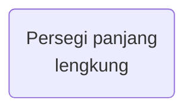
> + `SimpulID([Nama simpul])`: simpul berbentuk lapangan sepak bola atau stadion (persegi panjang dengan sisi kiri/kanan melingkar)
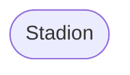
> + `SimpulID[[Nama simpul]]`: simpul berbentuk persegi panjang dengan garis dobel pada sisi kiri/kanan
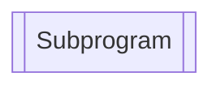
> + `SimpulID[(Nama simpul)]`: simpul berbentuk silinder
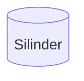
> + `SimpulID((Nama simpul)`: simpul berbentuk lingkaran
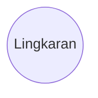
> + `SimpulID>Nama simpul]`: simpul berbentuk seperti persegi panjang dengan sisi kiri mirip ekor ikan
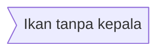
> + `SimpulID{Nama simpul}`: simpul berbentuk belah ketupat
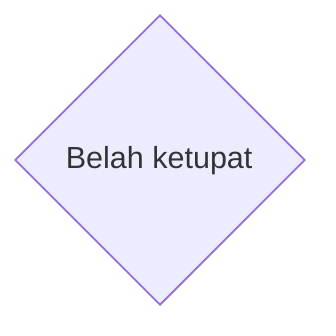
> + `SimpulID{{Nama simpul}}`: simpul berbentuk segi enam
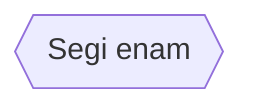
> + `SimpulID[/Nama simpul/]`: simpul berbentuk jajar genjang
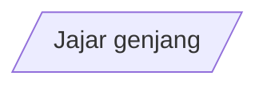
> + `SimpulID[\Nama simpul\]`: simpul berbentuk jajar genjang miring kiri
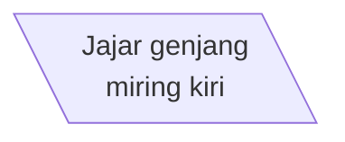
> + `SimpulID[/Nama simpul\]`: simpul berbentuk trapesium
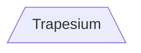
> + `SimpulID[\Nama simpul/]`: simpul berbentuk trapesium terbalik
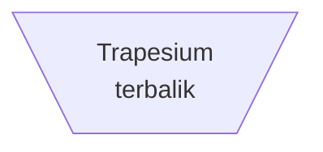
4. Selain bentuk-bentuk baku di atas, model pembatas bentuk dan warna latar simpul juga dapat domidifikasi dengan menggunakan sintaks:
```markdown
style simpulID opsi
```
> dengan `simpulID` adalah identitas simpul yang akan dimodifikasi bentuknya, `opsi` adalah pilihan untuk model/warna tulisan, garis pembatas dan latar. Berikut adalah contoh bentuk simpul dengan model yang dimodifikasi.
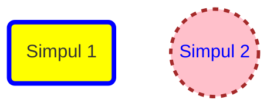
> Apabila model simpul yang sama sering dipakai, dapat digunakan definisi kelas dengan perintah `classDef`:
> ```
> classDef namaModel modelSimpul
> ```
> Berikut adalah contoh mendefinisikan kelas model dan cara penggunaannya.
```markdown
classDef model1 fill:yellow,stroke:blue,stroke-width:4px
classDef model2 fill:pink,stroke:brown,stroke-width:3px,color:blue,stroke-dasharray: 5 5
```
```markdown
    class simpulID namaModel;
    class simpul1,simpul2 namaModel;
    simpulID:::namaModel;
```
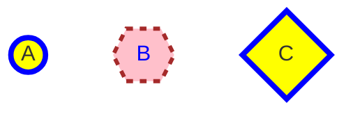
5. Untuk **menghubungkan simpul A dan simpul B** (membuat tautan atau *link* antara simpul A dan B) digunakan sintaks perintah:
> + `A-->B`: tautan dengan anak panah, 

> + `A---B`: tautan terbuka (tanpa anak panah)
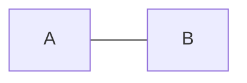
> + `A-- Teks ---B` atau `A-- |Teks|B`: tautan terbuka dengan teks,
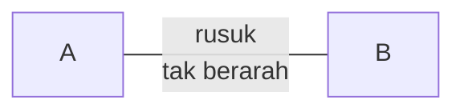
> + `A-->|Teks|B` atau `A-- Teks -->B`: tautan dengan anak panah dan teks,
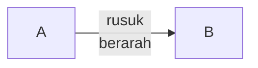
> + `A-.->B`: tautan berupa titik-titik dengan anak panah,
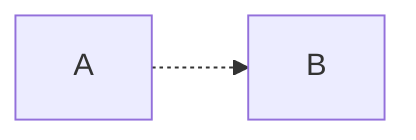
> + `A-. Teks .-> B`: tautan berupa titik-titik dengan anak panah dan teks,
```mermaid
graph LR
    A-. jaur rawan .->B
```
> + `A ==> B`: tautan berupa garis tebal dengan anak panah,
```mermaid
graph LR
    A==>B
```
> + `A == Teks ==> B`: tautan berupa garis tebal dengan teks dan anak panah
```mermaid
graph LR
    A== implikasi ==>B
```
6. Pada graf, tautan dapat menghubungkan suatu simpul dengan dirinya sendiri (*loop*).

```mermaid
flowchart LR
A((A)) -->A
```
7. Untuk perintah `flowchart` terdapat jenis *link* dengan ujung berupa noktah hitam atau tanda silang, baik pada ujung akhir maupun kedua ujung, serta anak panah pada kedua ujung *link*.

```markdown
flowchart LR
A((A)) --> B((B)); A<-->C; B o--o D; C x--x B; A--x D ; C((C)) --o D((D))
```


```mermaid
flowchart LR
A((A)) --> B((B)); A<-->C; B o--o D; C x--x B; A--x D ; C((C)) --o D((D))
```
8. Tanda `&` dapat digunakan untuk mendefinisikan link-link multi-simpul yang ditulis dalam satu baris tanpa titik koma. Ini akan menghemat penulisan perintah untuk membuat banyak link.
```markdown
graph LR
   a --> b & c--> d
```
```mermaid
graph LR
   a --> b & c--> d
```
> Diagram di atas apabila dibuat dengan menggunakan sintaks perintah biasa memerlukan empat perintah.
```markdown
graph LR
    a --> b; a --> c;  b --> d;    c --> c
```
```markdown
graph TB
    A & B--> C & D
```
```mermaid
graph TB
    A & B--> C & D
```
> Diagram di atas apabila dibuat dengan menggunakan sintaks perintah biasa memerlukan empat perintah.
```markdown
graph TB
    A --> C;     A --> D;     B --> C;     B --> D
```
9. Warna dan ketebalan garis penghubung dapat dimodifikasi dengan menggunakan perintah `linkStyle`:
>```
> linkStyle noLink opsi;
>```
> dengan `noLink` adalah urutan (dimulai dari nol) link sesuai perintah, `opsi` adalah opsi untuk menentukan warna dan ketebalan garis penghubung.
```markdown
flowchart LR
    A((A))-->B((B))-->C((C))
    A-.-C; B<-->B
    linkStyle 0 stroke:blue,stroke-width:4px;
    linkStyle 1 stroke:brown,stroke-width:4px;
    linkStyle 2 stroke:green,stroke-width:2px;
    linkStyle 3 stroke:red,stroke-width:2px;
```

```mermaid
flowchart LR
    A((A))-->B((B))-->C((C))
    A-.-C; B<-->B
    linkStyle 0 stroke:blue,stroke-width:4px;
    linkStyle 1 stroke:brown,stroke-width:4px;
    linkStyle 2 stroke:green,stroke-width:2px;
    linkStyle 3 stroke:red,stroke-width:2px;
```
10. Panjang dan bentuk link antar simpul akan secara otomatis disesuaikan berdasarkan link-link yang harus dibuat dan simpul-simpul yang terlibat. Meskipun demikian, kita dapat menambah panjang suatu link dengan menambah karakter pembentuk link, seperti dirangkum dalam tabel berikut ini. Untuk link yang memuat teks perlu ditambah ekstra dua karakter pembentuk link sesuai sintaks yang dijelaskan di atas.

|Jenis link antar simpul \ Panjang| 1 | 2 | 3 |
|---|:---:|:----:|:----:|
|Garis normal|`---`|`----`|`-----`|
|Garis normal+anak panah|`-->`|`--->`|`---->`|
|Garis tebal|`===`|`====`|`=====`|
|Garis tebal+anak panah|`==>`|`===>`|`====>`|
|Garis titik-titik|`-.-`|`-..-`|`-...-`|
|Garis titik-titik+anak panah|`-.->`|`-..->`|`-...->`|

Berikut adalah contoh-contoh dasar diagram alur.

```markdown
graph TD;
	Mulai --> Berhenti
    A-->B;A-->C     
    B-->D;C-->D;
```

```mermaid
graph TD;
	Mulai --> Berhenti
    A-->B;A-->C     
    B-->D;C-->D;
```
```markdown
graph LR
   A -- jalur 1 --> B -- jalur 2 --> C
```

```mermaid
graph LR
   A -- jalur 1 --> B -- jalur 2 --> C
```
###  [Subgraf](https://mermaid-js.github.io/mermaid/#/flowchart?id=subgraphs)

Baik perintah `graph` maupun `flowchart` dapat memuat perintah `subgraph` untuk membuat suatu graf atau diagram alur dengan beberapa subgraf atau subdiagram alur. Selain menggunakan perintah `subgraph`, sebenarnya untuk menggambar subgraf dapat digunakan graf atau diagram alur dengan identitas simpul yang berbeda. Sintaks untuk membuat subgraf adalah sebagai berikut. 
```markdown
subgraph sgID [Nama subgraf]
    perintah1; perintah2; ...
end
```
dengan `bgID` adalah identitas subgraf (sebagai rujukan) dan `Nama subgraf` adalah judul subgraf yang akan ditampilkan.
Berikut adalah beberapa contoh graf dengan subgraf.

```markdown
graph TB
    c1-->a2
    subgraph id1 [subgraf]
    a1-->a2
    end
```

```mermaid
graph TB
    c1-->a2
    subgraph id1 [subgraf]
    a1-->a2
    end
```
```markdown
graph TB
    c1-->a2
    subgraph G1
    a1-->a2
    end
    subgraph G2
    b1-->b2
    end
    subgraph G3
    c1-->c2
    end
```

```mermaid
graph TB
    c1-->a2
    subgraph G1
    a1-->a2
    end
    subgraph G2
    b1-->b2
    end
    subgraph G3
    c1-->c2
    end
```
```markdown
graph TD
subgraph Alur 1
    A([Mulai]) --> B{Yakin?}; B -->|Ya| C[OK]; C --> D[Ragu2];D --> B;
    B ---->|Tidak| E([Selesai]);
end
subgraph Alur 2
    a([Mulai]) --> b{Yakin?}; b -- Ya --> c[OK]; c --> d[Ragu2];
    d --> b; b -- Tidak ----> e([Selesai]);
end
```

```mermaid
graph TD
subgraph Alur 1
    A([Mulai]) --> B{Yakin?}; B -->|Ya| C[OK]; C --> D[Ragu2];D --> B;
    B ---->|Tidak| E([Selesai]);
end
subgraph Alur 2
    a([Mulai]) --> b{Yakin?}; b -- Ya --> c[OK]; c --> d[Ragu2];
    d --> b; b -- Tidak ----> e([Selesai]);
end
```
Untuk jenis graf `flowchart` dimungkinkan menghubungkan antar subgraf. 

```markdown
flowchart LR
    subgraph G1
    a1-->a2
    end
    subgraph G2
    b1-->b2
    end
    subgraph G3
    c1-->c2
    end
    G3 --> G1
    G2 --> G3
    G2 --> G1
    linkStyle 3 stroke:red,stroke-width:4px;
    linkStyle 4 stroke:red,stroke-width:4px;
    linkStyle 5 stroke:red,stroke-width:4px;
```

```mermaid
flowchart LR
    subgraph G1
    a1-->a2
    end
    subgraph G2
    b1-->b2
    end
    subgraph G3
    c1-->c2
    end
    G3 --> G1
    G2 --> G3
    G2 --> G1
    linkStyle 3 stroke:red,stroke-width:4px;
    linkStyle 4 stroke:red,stroke-width:4px;
    linkStyle 5 stroke:red,stroke-width:4px;
```
#### Contoh Diagram Alur: Menyelesaikan Persamaan Kuadrat

```mermaid
flowchart
	A([Akar persamaan kuadrat ax^2+bx+c=0]) -->B[/Baca: a,b,c/]
    B --> C[Hitung: D=b^2-4ac]
    C --> E{Apakah D<0?}
    E -->|Ya| F[Tidak ada akar nyata]
    E -->|Tidak| G{D=0?}
    G -->|Ya| H[Satu akar nyata]
    G -->|Tidak| I[2 Akar nyata]
    F --> S([Selesai])
    H --> S([Selesai])
    I --> S([Selesai])
```

Sayangnya Mermaid tidak mengenali perintah LaTeX.

## Diagram Lingkaran

> Diagram lingkaran adalah grafik statistik berupa lingkaran yang dibagi menjadi beberapa sektor untuk mengilustrasikan proporsi numerik data. Dalam diagram lingkaran, panjang busur setiap sektor (dan akibatnya sudut pusatnya), sebanding dengan kuantitas yang diwakilinya. Meskipun dinamai karena kemiripannya dengan roti loyang (*pie*) yang diiris-iris, terdapat variasi bentuk/penyajian diagram lingkaran. Diagram lingkaran pertama yang diketahui umumnya dikaitkan dengan Statistik Breviary dari William Playfair tahun 1801 - **Wikipedia**.

Untuk membuat diagram lingkaran dengan Mermaid sangatlah mudah. Perintah yang digunakan adalah `pie` diikuti (pilihan) dengan `title Teks judul` dan set data yang berupa daftar pasangan label dan nilai datanya dispisahkan dengan titik dua (:).  Label data ditulis dengan tanda kutip dobel.

```markdown
pie title Apakah Anda menyukai Markdown?
	"Sangat suka":78
	"Suka":185
	"Tidak suka":25
	"Sangat tidak suka": 15
```

```mermaid
pie title Apakah Anda menyukai Markdown?
"Sangat suka":78
"Suka":185
"Tidak suka":25
"Sangat tidak suka": 15
```

## Diagram urutan (*Sequence Diagram*)

>
>```mermaid
>graph LR
>D[Diagram UML]-->B[Diagram<br> Perilaku]
>D-->S[Diagram<br> Struktur]
>B-->A[Diagram Aktivitas]; S-->Pa[Diagram Paket]; S--->CS[Diagram <br> Struktur Komposit]
>B--->I[Diagram<br> Interaksi];S-->De[Diagram<br> Deployment]; S --->Pr[Diagram Profil] 
>B-->UC[Diagram <br>Use Case]; S-->Kl[Diagram Kelas]; S--->O[Diagram Objek]
>B--->SM[Diagram<br> Status Mesin]; S-->K[Diagram<br> Komponen]
>I-->Ko[Diagram<br> Komunikasi]; I-->IO[Diagram<br> Overview Interaksi]
>I-->Seq[Diagram Urutan]; I-->T[Diagram Timing]
>style D stroke:black,stroke-width:4px
>style B fill:cyan,stroke:brown,stroke-width:4px
>style I fill:yellow,stroke:blue,stroke-width:4px
>style Seq fill:pink,stroke:brown,stroke-width:3px,color:blue,stroke-dasharray:5 5
>```
>[Diagram urutan](https://mermaid-js.github.io/mermaid/#/sequenceDiagram) adalah diagram interaksi (dalam bentuk pesan) antar objek (pengguna, sistem, subsistem), dalam konteks kerja sama, yang disusun dalam urutan waktu untuk menunjukkan bagaimana suatu operasi dilakukan. Diagram urutan merupakan salah satu jenis diagram **UML** (*Unified Modelling Language*) untuk menggambarkan objek yang terlibat dalam skenario dan rangkaian pesan antar objek yang diperlukan untuk melakukan skenario tersebut. Diagram urutan biasanya digunakan di dalam rekayasa dan pengembangan software atau sistem dan dikaitkan dengan realisasi suatu kasus penggunaan atau suatu operasi dalam [tampilan logika](https://en.wikipedia.org/wiki/4%2B1_architectural_view_model) sistem yang sedang dikembangkan. Diagram urutan terkadang disebut **diagram peristiwa** atau **skenario acara** ([Wikipedia](https://en.wikipedia.org/wiki/Sequence_diagram), [Visual Paradigm](https://www.visual-paradigm.com/guide/uml-unified-modeling-language/what-is-sequence-diagram/)).

Komponen-komponen suatu diagram urutan terdiri atas:

+ **aktor**: peran yang dimainkan oleh entitas di dalam sistem atau yang berinteraksi dengan sistem, tidak selalu manusia (misalnya pengguna sistem, komponen sistem, sistem luar, perangkat eksternal, dsb.) – seseorang dapat memainkan peran beberapa aktor dan sebaliknya aktor dapat dimainkan beberapa orang berbeda
+ **garis-garis vertikal** (*garis hidup)*: menyajikan peserta interaksi, yang hidup bersamaan, dan menunjukkan urutan (dari atas ke bawah) proses interaksinya
+ **aktivasi**: berupa **persegi panjang tipis** pada garis hidup, menunjukkan periode berlangsungnya suatu operasi
+ **pesan**: menunjukan komunikasi (interaksi) antar garis hidup, dapat berupa pesan panggilan (sebagai pengaktifan operasi yang harus dilakukan oleh garis hidup target), pesan balasan, pesan ke diri sendiri, atau pesan rekursif

+ **garis-garis horizontal** (dengan atau tanpa anak panah): menunjukkan pesan antar objek atau proses tersebut, disusun dari atas ke bawah sesuai urutan terjadinya. Teks pesan ditulis di atas garis-garis mendatar
+ **Catatan (notes)**: informasi tekstual yang terkait dengan komponen tertentu, yang mungkin berguna bagi pembuat model.

Karena interaksi dan komunikasi dapat terjadi antar manusia, maka diagram urutan juga dapat digunakan untuk menggambarkan proses dialog antar orang.

```mermaid
sequenceDiagram
    Ali-->>Burhan: Assalaamuálaikum Burhan, apa kabar?
    Burhan-->>Ali: Alhamdulillah!
    Ali-->>Burhan: Assalaamuálaikum!
```

### Sintaks untuk membuat diagram urutan

Sintaks umum untuk menggambar diagram urutan adalah sebagai berikut.

```markdown
```mermaid
sequenceDiagram
	perintah1;
	perintah2;
	...
​```
```

**Participant** (Aktor)

Aktor dapat didefinisikan secara implisit seperti mendefinisikan simpul pada graf atau diagram alur. Aktor akan digambar sesuai urutan penyebutannya di dalam perintah untuk menggambar. Selain secara implisit, aktor dapat didefinisikan secara eksplisit dengan menggunakan perintah `participant`.


**Alias**

Aktor dapat diberi identitas (label) dan nama deskriptif dengan menggunakan kata `as` di belakang perintah `participant`. Label digunakan sebagai rujukan, sedangkan nama deskriptif adalah nama yang ditampilkan didalam diagram.

```mermaid
sequenceDiagram
    participant A as Ali
    participant B as Budi
    A->>B: Hi Bud, Assalaamuálaikum?
    B->>A: Waálaikumussalaam, Ali!
```
**Pesan**
Pesan atau kata-kata dialog dapat ditampilkan dengan menggunakan garis atau anak panah mulus maupun putus-putus. Sintaks penulisan pesan adalah sebagai berikut.

```markdown
[Aktor1][Garis][Aktor2]: Teks pesan
```
Terdapat enam jenis garis yang didukung oleh **Mermaid versi 8.9.1**:

Jenis |Deskripsi
---|---
`->`| Garis mulus tanpa anak panah
`-->`| Garis putus-putus tanpa anak panah
`->>`|Garis mulus dengan anak panah
`-->>`|Garis putus-putus dengan anak panah
`-x`|Garis mulus dengan tanda silang di ujung
`--x`|Garis putus-putus dengan tanda silang di ujung
`-)`|Garis mulus dengan anak panah terbuka di ujung (asinkron)
`--)`|Garis putus-putus dengan anak panah terbuka di akhir (asinkron)

**Catatan**: Typora 0.9.98 belum mendukung dua jenis garis terakhir, karena Typora 0.9.98 masih menggunakan Mermaid versi 8.8.3. Dokumen ini diketik menggunakan Typora 0.9.98.

**Aktivasi Aktor**

Setiap aktor dapat diaktifkan (untuk meunjukkan awal operasi) dan di-nonaktifkan (untuk menunjukkan akhir operasi) dengan menggunakan perintah `activate`  (atau tanda `+` di belakang garis pesan) dan `deactivate` (atau tanda `-` di belakang garis pesan).

```mermaid
sequenceDiagram
    Ali->>Budi: Assalaamuálaikum Bud, apa kabar?
    activate Budi
    Budi-->>Ali: Alhamdulillah!
    deactivate Budi
```

Ada juga notasi pintasan dengan menambahkan / akhiran ke panah pesan:`+``-`

```mermaid
sequenceDiagram
    Ali->>+Budi: Assalaamuálaikum Bud, apa kabar?
    Budi-->>-Ali: Alhamdulillah!
```

Aktivasi dapat ditumpuk untuk aktor yang sama:

```mermaid
sequenceDiagram
    Ali->>+Budi: Assalaamuálaikum Bud, apa kabar?
    Ali->>+Budi: Helo Bud, kamu dengar saya ga?
    Budi-->>-Ali: Waálaikumussalam, Alhamdulillah!
    Budi-->>-Ali: Keadaanmu gimana, Ali?
```

**Catatan**

Dimungkinkan untuk menambahkan catatan ke dalam diagram urutan, dengan menggunakan sintaks:

 ```markdown
Note [right of|left of ] [Aktor]: Teks catatan
Note over [Aktor1, Aktor2, ...]: Teks catatan
 ```

**Loop**

*Loop* adalah proses yang dapat diulang di dalam diagram urutan. Untuk menandai suatu loop di dalam diagram urutan digunakan sintaks:

```markdown
loop Teks nama/keterangan loop
	perintah1; perintah2; ...
end
```

Proses yang diulang akan diberi kotak putus-putus dan diberi label `loop`.

**Proses alternatif dan opsional**

Diagram urutan dapat memuat proses alternatif atau proses pilihan (opsional). Untuk menuliskan proses alternatif dan proses opsional dapat digunakan sintaks:

```markdown
alt Teks keterangan
	perintah1; perintah2; ...
else
	perintahlain1; perintahlain2; ...
end
opt Teks keterangan
	perintah1, 	perintah2, ...
end
```

**Proses paralel**

Beberapa proses dapat dilakukan secara bersamaan/paralel. Untuk menandai beberapa proses paralel digunakan sintaks:

```markdown
par proses1
	perintah11; perintah12; ...
and proses2
	perintah21; perintah22; ...
and proses3
	perintah31, perintah32, ...
and ...
	...
end
```

**Warna latar belakang**

Aliran proses di dalam diagram urutan dapat disorot dengan warna latar belakang. Hal ini dapat digunakan menandai proses-proses penting di dalam diagram urutan tersebut. Untuk memberi warna latar belakang dapat digunakan sintaks  `rect rgb (kode warna)` atau `rect rgba(kode warna)`.

```markdown
rect rgb(0, 255, 0)
	perintah1; perintah2; ...
end
```

```markdown
rect rgba(0, 0, 255, .1)
	perintah1; perintah2; ...
end
```

**Penomoran otomatis (*autoNomor*)**

Untuk memberi nomor secara otomatis pada setiap garis dapat digunakan perintah `autoNomor`.

**Pengaturan diagram urutan**

Untuk pengaturan diagram urutan digunakan kelas-kelas **css**. Selama proses menghasilkan gambar, kelas-kelas css ini dikeluarkan dari file `src/themes/sequence.scss`. Kelas-kelas untuk pengaturan model diagram urutan adalah sebagai berikut.

Kelas |Penjelasan
---|:---
`.actor`|Model kotak aktor pada bagian atas diagram
`text.actor`|Model teks di dalam kotak aktor pada bagian atas diagram
`actor-line`|Garis tegak untuk aktor
`messageLine0`|Model untuk garis pesan mulus
`messageLine1`|Model untuk garis pesan putus-putus
`messageText`|Model untuk teks pesan
`labelBox`|Model kotak label kiri pada loop
`labelText`|Model penulisan label pada loop
`loopText`|Model penulisan teks pada loop
`loopLine`|Model garis kotak loop
`note`|Model kotak untuk menulis catatan
`noteText`|Model tulisan pada kotak catatan.

Berikut adalah contoh pengaturan model diagram urutan di dalam file css.

```markdown
body {
    background: white;
}
.actor {
    stroke: #ccccff;
    fill: #ececff;
}
text.actor {
    fill: black;
    stroke: none;
    font-family: Helvetica;
}
.actor-line {
    stroke: grey;
}
.messageLine0 {
    stroke-width: 1.5;
    stroke-dasharray: '2 2';
    marker-end: 'url(#arrowhead)';
    stroke: black;
}
.messageLine1 {
    stroke-width: 1.5;
    stroke-dasharray: '2 2';
    stroke: black;
}
#arrowhead {
    fill: black;
}
.messageText {
    fill: black;
    stroke: none;
    font-family: 'trebuchet ms', verdana, arial;
    font-size: 14px;
}
.labelBox {
    stroke: #ccccff;
    fill: #ececff;
}
.labelText {
    fill: black;
    stroke: none;
    font-family: 'trebuchet ms', verdana, arial;
}
.loopText {
    fill: black;
    stroke: none;
    font-family: 'trebuchet ms', verdana, arial;
}
.loopLine {
    stroke-width: 2;
    stroke-dasharray: '2 2';
    marker-end: 'url(#arrowhead)';
    stroke: #ccccff;
}
.note {
    stroke: #decc93;
    fill: #fff5ad;
}
.noteText {
    fill: black;
    stroke: none;
    font-family: 'trebuchet ms', verdana, arial;
    font-size: 14px;
}
```

Pengaturan lain dapat dialkukan melalui file konfigurasi yang memuat `mermaid.sequenceConfig` dengan parameter-parameter seperti contoh berikut ini.

```markdown
mermaid.sequenceConfig = {
    diagramMarginX: 50,
    diagramMarginY: 10,
    boxTextMargin: 5,
    noteMargin: 10,
    messageMargin: 35,
    mirrorActors: true
};
```

Berikut adalah parameter-parameter yang mungkin digunakan untuk mengatur huruf dan teks.
Parameter|Penjelasan|Nilai asli
---|---|---
`mirrorActors`|Apakah nama aktor ditutilis dobel di atas dan di bawah|false
`bottomMarginAdj`|Mengatur batas bawah gambar diagram|1
`actorFontSize`|Ukuran huruf untuk nama aktor|14
`actorFontFamily`|Jenis huruf untuk nama aktor|"Open-Sans", "sans-serif"
`actorFontWeight`|Bobot huruf untuk nama aktor|"Open-Sans", "sans-serif"
`noteFontSize`|Ukuran huruf untuk catatan pada nama aktor|14
`noteFontFamily`|Jenis huruf untuk catatan pada nama aktor|"trebuchet ms", verdana, arial
`noteFontWeight`|Bobot huruf untuk catatan pada nama aktor|"trebuchet ms", verdana, arial
`noteAlign`|Perataan teks untuk catatan pada nama aktor|center
`messageFontSize`|Ukuran huruf untuk pesan|16
`messageFontFamily`|Jenis huruf untuk pesan| "trebuchet ms", verdana, arial
 `messageFontWeigh`  | Bobot huruf untuk pesan                                | "trebuchet ms", verdana, arial
#### Contoh Diagram Urutan: SOP Daftar Ulang Semester Mahasiswa

```mermaid
sequenceDiagram
    autonumber
    participant M as Mahasiswa
    participant B as Bank <br>(ATM/Teller)
    participant S as Siakad/<br>SiPembayaran
    participant J as Sistem <br>Penjadwalan Kuliah
    participant A as Bagian<br> Akademik
    participant D as Dosen <br>Pembimbing<br> Akademik
    activate M
    rect rgba(200, 0, 255, .3)
	    M->>B: Bayar SPP Semester
    	loop CekDataMhs
       		  B ->> S: Cek data mahasiswa<br> dan SPP UKT
   		end
    	B-->>M: Bukti pembayaran SPP
    end
    rect rgba(20, 0, 255, .2)
    	par 
   			 M->>S: Entri Matakuliah
    	and
    	loop CekJadwal
       		M->>J: Cek jadwal MK yang akan diambil
    	end
    	and
    	rect rgba(200, 0, 255, .5)
    		loop CekRegristrasi
        		S->>S: Cek data mahasiswa,<br>pembayaran,<br> IP semester sebelumnya
        		Note right of S: Nilai semester lalu<br> mungkin belum masuk
    		end
    	end
        end
    end
    M->>+D: Konsultasi Dosen PA
    D->>-S: Dosen PA menyetujui KRS Mahasiswa di Siakad
    S->>M: Cetak KRS
    J-->>M: Cetak Jadwal Kuliah
    M->>A: Pengesahan KRS
    M-->>D: Arsip KRS
    deactivate M
    M-->>M: Siap mengikuti kuliah
```

## Diagram Perubahan/Transisi Status

> "Diagram perubahan/transisi status ([*state diagram*](https://github.com/mermaid-js/mermaid/blob/develop/docs/stateDiagram.md)) adalah jenis diagram yang digunakan untuk menggambarkan perubahan status suatu komponen dalam sebuah sistem. " Wikipedia

Diagram status juga dapat digunakan untuk mengambar suatu graf dalam matematika. Sintaks **Mermaid** untuk menggambar diagram status mirip dengan sintaks **[plantUML](https://plantuml.com/)**. Mermaid dapat digunakan untuk menggambar diagram status pada file Markdown.  Perhatikan cotoh diagram perubahan status berikut ini.

```markdown
stateDiagram-v2
    [*] --> Hidup Hidup-->Sehat
    Sehat --> Kecelakaan Kecelakaan --> Sakit Kecelakaan -->Mati
    Sehat --> Sakit Sakit --> Sehat  Sakit --> Mati
    Sehat --> Mati Mati-->[*]
```


```mermaid
stateDiagram-v2
    [*] --> Hidup Hidup-->Sehat Hidup --> Sakit
    Sehat --> Kecelakaan Kecelakaan --> Sakit Kecelakaan -->Mati
    Sehat --> Sakit Sakit --> Sehat  Sakit --> Mati
    Sehat --> Mati Mati-->[*]
```

Contoh diagram di atas menggambarkan perubahan status orang hidup menjadi mati. Orang yang hidup dapat sehat atau sakit sebelum mati. Orang sehat dapat sakit dengan atau tanpa mengalami kecelakaan. Orang yang mengalami kecelakaan juga dapat langsung mati. Orang yang sakit dapat kembali sehat atau mati. Orang sehat pun dapat tiba-tiba mati!

**Status**

Status dapat didefinisikan dengan beberapa cara. 

1. mendefinisikan status dengan menggunakan deskripsi status tersebut

```mermaid
stateDiagram-v2
    status
```

2. menggunakan perintah `state "Teks deskripsi" as statusID`

```mermaid
stateDiagram-v2
    state "Kondisi status" as status
```

3. menggunakan sintaks `statusID: Teks deskripsi`

```mermaid
stateDiagram-v2
    status : Deskripsi status
```

4. **Transisi**

   > Transisi adalah garis dengan anak panah yang menunjukkan perubahan status dari status yang satu ke status yang lain. Sintaks untuk menuliskan suatu transisi adalah `status1-->status2`. Apabila `status1` dan `status2` belum didefinisikan, otomatis akan didefinisikan bersamaan dengan gambar transisinya.  Suatu transisi dapat diberi teks penjelasan dengan sintaks: `status1-->status2: Teks penjelasan`

```mermaid
stateDiagram-v2
   hidup --> mati
   on-->off: tekan saklar
   off-->on: tekan saklar
   
```

5. **Awal dan akhir**

   > Terdapat dua simpul khusus untuk menandai awal dan akhir diagram. Simpul ini  didefinisikan dengan simbol `[*]` . Lihat contoh pertama di atas.

6. **Status majemuk**

   > Dalam kenyataan sering dijumpai suatu status yang di dalamnya memuat transisi antar status  internal di dalam status tersebut. Status yang memuat beberapa status internal disebut status majemuk. Status majemuk dapat bersifat multilapis. Transisi juga dapat dilakukan antar status majemuk maupun antara status tunggal dan status majemuk. **Transisi tidak dapat dilakukan antar status internal dari status majemuk yang berbeda.** Untuk mendefinisikan suatu status majemuk digunakan sintaks sebagai berikut. 
   >
   > ```markdown
   > state statusID { ... }
   > ```
```mermaid
stateDiagram-v2
%% [*] --> s1
    state Hidup {
        [*] --> terjaga terjaga-->tidur tidur-->terjaga tidur--> [*]
    }
%%  [*] --> First
    state Sehat {
    	  Terjaga -->Tidur Tidur-->Terjaga
          state Terjaga {
            [*] --> Beraktivitas Beraktivitas-->Istirahat 
            Istirahat-->Beraktivitas Istirahat--> [*]
		  }
          state Tidur {
                [*] --> Bergerak Bergerak-->Diam 
                Diam-->Bergerak Diam--> [*]
            }
    }
```
7. **Status Fork**
  
   > Status ***fork*** dalam diagram status tidak ditampilkan nama statusnya, tetapi dalam bentuk persegi panjang tipis seperti garis tebal. Untuk mendefinisikan status *fork* digunakan sintaks `state statusID <<fork>>` dan `state statusID <<join>>`. 

```mermaid
   stateDiagram-v2
    state f1 <<fork>>
      [*] --> f1
      f1 --> Terbuka
      f1 --> Tak_terkunci

      state f2 <<join>>
      Terbuka --> f2
      Tak_terkunci --> f2
      f2 --> Tertutup
      Tertutup --> [*]
```
8. **Catatan**
   Untuk menamabahkan catatan pada suatu status dapat digunakan sintaks sebagai berikut.
   ```markdown
   note [right|left] of [statusID]
   	Teks catatan ...
   	Teks catatan ...
   	end note
   ...
   note [right|left] of [statusID]: Teks catatan
   
   ```
```mermaid
    stateDiagram-v2
        Hidup
        note right of Hidup
            Jangan melakukan hal-hal 
            yang jelek. Banyak melakukan
            amal kebaikan.
        end note
        Hidup --> Mati
        note left of Mati : Akan menerima buah amal kebaikan<br> atau keburukan selama hidup.
```
9. ***Concurrency***
    Suatu status di dalamnya mungkin terdiri atas beberapa transisi yang dapat terjadi seacra bersamaan (*concurrency*).  Untuk membuat suatu *concurrency* digunakan sintaks sebgai berikut. 

  ```
  state statusID {
  	transisi11 transisi12 ...
  	---
  	transisi21 transisi22 ...
  	---
  	...
  }
  ```

  

```mermaid
stateDiagram-v2
    [*] --> Active

    state Active {
        [*] --> NumLockOff
        NumLockOff --> NumLockOn : EvNumLockPressed
        NumLockOn --> NumLockOff : EvNumLockPressed
        --
        [*] --> CapsLockOff
        CapsLockOff --> CapsLockOn : EvCapsLockPressed
        CapsLockOn --> CapsLockOff : EvCapsLockPressed
        --
        [*] --> ScrollLockOff
        ScrollLockOff --> ScrollLockOn : EvScrollLockPressed
        ScrollLockOn --> ScrollLockOff : EvScrollLockPressed
    }
```

#### Contoh Diagram Status (Mesin ATM)

```mermaid
stateDiagram-v2
	[*]-->Off 
		state ATM_Bank {
		On-->Off: Turn Off/Shut Down
		Off-->Self_Test: Turn On/Start Up
		Self_Test-->On On-->Melayani_Pelanggan:Card Inserted 
		Melayani_Pelanggan-->On:Batal
		Melayani_Pelanggan-->Rusak: Gagal
		Rusak-->Off: Turn off/Shut Down
		On-->Perawatan: Diservis
		Perawatan-->Rusak: Gagal
		Rusak-->Perawatan: Diservis
		Perawatan-->Self_Test Self_Test-->Rusak
		--
	state Melayani_Pelanggan {
		entry/readCard<br>exit/ejectCard
		[*]-->CekPIN CekPIN-->PilihTransaksi 
		PilihTransaksi-->Transaksi Transaksi-->[*]
	}}
```
## Diagram Klasifikasi (Kelas)
```mermaid
classDiagram
      Segitiga <-- Segitiga Sebarang
      Segitiga <-- Segitiga Samakaki
      Segitiga <-- Segitiga Samasisi
      Segitiga <-- Segitiga Siku2
      Segitiga Samasisi --> Segitiga Samakaki
      
      Segitiga : 3 titik_sudut
      Segitiga : 3 sisi
      Segitiga : 3 sudut
      Segitiga : 3 titik_tidak_segaris()
      Segitiga : jumlah_sudut 180_derajat()
      Segitiga : jumlah_dua_sisi melebihi_sisi_ketiga()
      class Segitiga Sebarang{
          panjang_sisi beda_semua
          besar_sudut beda_semua}
      class Segitiga Samakaki{
          2 sisi_sama_panjang
          2 sudut_sama_besar()}
      class Segitiga Samasisi{
          3 sisi_sama_panjang
          3 sudut_sama_besar()}
      class Segitiga Siku2{
          1 sudut_siku2    }
```
> "Dalam rekayasa perangkat lunak, diagram kelas dalam Bahasa Pemodelan Terpadu (UML) adalah jenis diagram struktur statis yang menggambarkan struktur sistem dengan menunjukkan kelas sistem, atribut, operasi (atau metode) mereka, dan hubungan di antara objek." Wikipedia

Pada diagram kelas, kelas disajikan dengan kotak yang terdiri atas tiga bagian: 

+ bagian atas memuat nama kelas, dicetak dengan huruf tebal dan mengikuti kaidah penulisan nama (huruf pertama ditulis dengan huruf besar);
+ bagian tengah berisi atribut (misalnya, pengertian/definisi) kelas tersebut, dicetak rata kiri, huruf pertama ditulis dengan huruf kecil; 
+ bagian bawah berisi operasi yang dapat dilakukan oleh (atau sifat) kelas tersebut, dicetak rata kiri, huruf pertama ditulis dengan huruf kecil.

Meskipun aslinya diagram kelas digunakan di dalam rekayasa perangkat lunak, diagram kelas dapat juga digunakan untuk menggambarkan klasifikasi dalam bidang-bidang lain, seperti biologi, matematika, fisika, dan sebagainya. (https://mermaid-js.github.io/mermaid/#/classDiagram?id=syntax)

### Sintaks

Diagram kelas dapat didefinisikan dengan menggunakan perintah **Mermaid** `classDiagram`. Selanjutnya, untuk menggambar komponen-komponen diagram digunakan perintah-perintah yang terkait dengan kelas dan hubungannya dengan anggota setiap kelas.

**Kelas**

UML menyediakan mekanisme untuk mendiskripsikan suatu kelas, seperti atribut, metode, dan informasi tambahan tentang kelas

```mermaid
classDiagram
	class Segitiga
	Segiempat <--Persegipanjang
    Segitiga : 3 titik_sudut
    Segitiga : 3 sisi
    Segitiga : 3 sudut
    Segitiga : 3 titik_tidak_segaris()
    Segitiga : jumlah_sudut 180_derajat()
    Segitiga : jumlah_dua_sisi melebihi_sisi_ketiga()
```

Untuk mendefinisikan kelas dapat dilakukan dengan dua cara:

+ secara eksplisit, dengan menggunakan kata perintah `class NamaKelas` 

+ mendefinisikan hubungan antara dua kelas dengan sintaks `Kelas1 <|-- Kelas2` atau `Kelas1 <-- Kelas2`.

+ Kelas dapat diberi keterangan atau label, yang dapat dituliskan dengan cara menambahkan  `<<Label>> namaKelas`  pada baris setelah definisi kelas, atau dengan menggunakan sintakas

  ```
  class namaKelas {
  <<label>>
  +atribut
  -sifat()
  }
  ```

  

```mermaid
classDiagram
    class Binatang
    Kendaraan <|-- Mobil
```

**Konvensi penamaan**: nama kelas hanya boleh berupa karakter *alfanumerik* (boleh berupa **unicode**) dan garis bawah.

**Atribut dan metode/operasi atau sifat serta informasi lain suatu kelas**

Untuk mendefinsikan atribut (misalnya definisi kelas) suatu kelas digunakan sintaks `namaKelas : Teks atribut`, dengan `Teks atribut` tidak memuat tanda kurung `()`, sedangkan untuk mendefinisikan metode/operasi atau sifat dan informasi lain suatu kelas digunakan sintaks `namaKelas : Teks atribut`, dengan `Teks atribut` memuat tanda kurung `()`. Baik teks aribut maupun teks sifat hanya boleh memuat satu spasi. 

Selain menggunakan tanda titik dua (:), untuk mendefinsikan atribut dan sifat suatu kelas dapat digunakan tanda kurung kurawal `{}`. Setiap atribut atau sifat ditulis pada baris terpisah. Cara ini lebih cocok untuk kelas yang memiliki beberapa atribut atau sifat. Ingat, perbedaan atribut dan sifat hanya pada penulisannya yang memuat tanda kurung pada sifat.

```markdown
classDiagram
	class Segitiga {
	3 titik_sudut
	3 sisi
	3 sudut
	3 titik_tidak_segaris()
	jumlah_sudut 180_derajat()
	jumlah_dua_sisi melebihi_sisi_ketiga()}
```

```mermaid
classDiagram
	class Segitiga {
	3 titik_sudut
	3 sisi
	3 sudut
	3 titik_tidak_segaris()
	jumlah_sudut 180_derajat()
	jumlah_dua_sisi melebihi_sisi_ketiga()} 
```

**Visibilitas**

Untuk menentukan visibilitas karakter kelas (yaitu atribut, metode, sifat, atau apa pun), dapat digunakan karakter `+`, `-`, `#`, atau `~`sebelumteks atribut atau sifat. Ini bersifat opsional.

+ `+` umum
+ `-` pribadi
+ `#` dilindungi
+ `~` paket/internal

> Anda juga dapat *menyertakan pengklasifikasi* tambahan ke definisi metode/sifat dengan menambahkan notasi berikut di belakangnya, yaitu: setelah tanda kurung`()`.

> + `*` Abstrak, misalnya: `someAbstractMethod()*`
> + `$` Statis, misalnya: `someStaticMethod()$`

**Hubungan antar kelas**

Hubungan antara dua kelas dituliskan dengan menggunakan sintaks:

 `[kelas1][Penghubung][kelas2]: Teks label`

Terdapat beberapa jenis garis penghubung yang dapat digunakan dalam diagram kelas.

| Penghubung         | Deskripsi            |
| ------------------ | -------------------- |
| `<|--` atau `--|>` | Warisan              |
| `*--` atau `--*`   | Komposisi            |
| `o--` atau `--o`   | Agregasi             |
| `<--` atau `-->`   | Asosiasi             |
| `--`               | Tautan (Solid)       |
| `.. >`  atau `<..` | Ketergantungan       |
| `<|..` atau `..|>` | Realisasi            |
| `..`               | Tautan (Putus-putus) |

```mermaid
classDiagram
KelasA --|> Kelas1: mewarisi
KelasB --* Kelas2: Komponen
KelasC --o Kelas3: Agregasi
KelasD --> Kelas4: Asosiasi
KelasE -- Kelas5: Berhubungan
KelasF <.. Kelas6: Tergantung pada
KelasG ..|> Kelas7: Merealisasikan
KelasH .. Kelas8: Berhubungan
```

**Kardinalitas Kelas**

Kardinalitas suatu kelas dalam diagram kelas adalah banyak kelas lain yang dihubungkan ke kelas tersebut.  Nilai kardinalitas suatu kelas dapat dituliskan didalam tanda kutip di ujung notasi penghubung. Nilai-nilai kardinalitas yang mungkin adalah sebagai berikut.

+ `1` : Hanya 1
+ `0..1` : Nol atau Satu
+ `1..*` : Satu atau banyak
+ `*` : Banyak
+ `n` : dengan n>1
+ `0..n` : nol sampai n (n>1)
+ `1..n` : satu sampai n (n>1)

Kardinalitas dapat dengan mudah didefinisikan dengan menempatkan teks kardinalitas dalam tanda kutip sebelum (opsional) dan setelah (opsional) panah yang diberikan.

`[kelas1] "Kardinalitas1"[Penghubung] "Kardinalitas2"[kelas2]: Teks label`

```mermaid
classDiagram
    Orang Tua "1" --> "n" Anak: Memiliki
    Mahasiswa "1" --> "1..n" Matakuliah: Mengambil
    Galaksi --> "*" Bintang : Terdiri atas
```

#### Contoh Diagram Kelas

```mermaid
classDiagram
	class Nama {<<Pengenal>> String}
	class Sekolah {
		Nama: Nama
		Guru: Daftar Guru }
	class Person {
		Id: Nomor
		Nama: Nama}
	class Guru {
		Id: Nomor
		Nama: Nama
		Pelajaran: Pelajaran}
	class Siswa {
		Id: Nomor
		Nama: Nama
		Pelajaran: Daftar Pelajaran
		Raport: Raport}
	class Pelajaran {
		Nama: Nama
		Keterangan: String}
	class Raport {
		Pelajaran: Daftar Pelajaran
		Nilai: Daftar Nilai}
	Sekolah --* Nama
	Sekolah --* Guru
	Person --* Nama
	Guru --|> Person
	Guru --* Pelajaran
	Guru --* Nama
	Siswa --|> Person
	Siswa --* Pelajaran
	Siswa --* Raport
	Siswa --* Nama
	Pelajaran --* Nama
	Raport --* Pelajaran
```
## Diagram Relasi Entitas
> Suatu diagram atau model relasi-entitas (model ER) menjelaskan keterkaitan antar hal-hal yang menjadi perhatian dalam suatu ranah pengethuan tertentu. Suatu model ER terdiri atas jenis-jenis entitas (klasifikasi hal-hal yang menjadi perhatian) dan hubungan antar entitas tersebut [Wikipedia](https://en.wikipedia.org/wiki/Entity–relationship_model).

Dalam praktik, jenis entitas dinyatakan sebagai entitas itu sendiri, meskipun secara teknis suatu entitas merupakan *wujud* abstrak suatu jenis entitas. Entitas selalu diberi nama dengan kata benda tunggal, misalnya `Pelanggan`. Perintah Mermaid untuk membuat diagram ER adalah `erDiagram`.

Hubungan antar entitas diyatakan dengan garis yang ujungnya dapat diberi tanda nilai kardinalitasnya. Diagram ER dapat digunakan untuk menggambarkan berbagai situasi mulai dari model logika abstrak sampai model-model fisik tabel basis data. Entitas pada diagram ER biasanya diberi atribut, untuk menyatakan maksud dan kegunaannya. 

**Sintaks**

Sintaks Mermaid syntax fountuk diagram ER kompatibel dengan PlantUML, dengan perluasan adanya label untuk relasi. Sintaks umum perintah dalam diagram ER adalah:

```markdown
    <entitas1> [<hubungan> <entitas2> : <label-hubungan>]
```

Sintaks tersebut menyiratkan bahwa suatu entitas dapat didefinsikan secara terpisah tanpa melalui melalui definisi relasi antar entitas. Nilai kardinalitas suatu entitas ditentukan oleh tanda di ujung kiri/kanan garis pendefinisi relasi, seperti dijelaskan pada tabel berikut ini.

| Nilai (kiri) | Nilai (kanan) | Makna                              |
| ------------ | ------------- | ---------------------------------- |
| `|o`         | `o|`          | nol atau satu                      |
| `||`         | `||`          | tepat satu                         |
| `}o`         | `o{`          | nol atau lebih (tanpa batas atas)  |
| `}|`         | `|{`          | satu atau lebih (tanpa batas atas) |

Sebagai contoh:

```markdown
  Rumah ||--|{ Kamar : memiliki
```
```mermaid
erDiagram
Rumah ||--|{ Kamar : memiliki
```
Perintah/diagram tersebut dapat dibaca “Rumah memiliki satu atau lebih kamar dan suatu kamar pasti hanya berada di dalam sebuah rumah”. 

+ Apabila label hubungan lebih dari satu kata, maka label hubungan tersebut diapit dengan tanda kutip ganda.
+ Jika Anda tidak menginginkan label sama sekali pada hubungan, Anda harus menggunakan string kosong yang diapit dengan tanda kutip ganda.
#### Contoh Diagram Relasi Entitas: Belanja Online
```mermaid
erDiagram
    Pelanggan }|..|{ Alamat-pengiriman : "memiliki/untuk"
    Pelanggan ||--o{ Pesanan : "melakukan/untuk"
    Pelanggan ||--o{ Tagihan : "menerima/untuk"
    Alamat-pengiriman ||--o{ Pesanan : "untuk/memiliki"
    Tagihan ||--|{ Pesanan : "untuk/memiliki"
    Pesanan ||--|{ Item-Barang-Pesanan : "memuat/mempunyai"
    Kategori-Produk ||--|{ Nama-Barang : "terdiri atas"
    Nama-Barang ||--o{ Item-Barang-Pesanan : "masuk dalam"
```
Cara membaca diagram di atas adalah sebagai berikut:
+ Seorang pelanggan dapat melakukan pesanan sebanyak nol (tidak memesan) atau lebih
+ Seorang pelanggan dapat menerima tagihan sebanyak pemesanannya
+ Seorang pelanggan dapat memiliki paling sedikit satu alamat
+ Satu pesanan hanya dapat dilakukan oleh satu orang
+ Setiap tagihan hanya ditujukan kepada seorang pelanggan
+ Setiap pesanan hanya boleh memiliki satu alamat pengiriman
+ dan seterusnya. 

### [User Journey Diagram](https://mermaid-js.github.io/mermaid/#/user-journey)

```mermaid
journey
    title My working day
    section Go to work
      Make tea: 5: Me
      Go upstairs: 3: Me
      Do work: 1: Me, Cat
    section Go home
      Go downstairs: 5: Me
      Sit down: 5: Me
```


>
> diagram perjalanan (*user journey*), dan diagram penjadwalan proyek (*Gantt chart*). 

### [Diagram Penjadwalan Proyek (*Gantt*)](https://mermaid-js.github.io/mermaid/#/gantt)


```mermaid
gantt 
dateFormat DD-MM-YYYY
	title Rencana Kegiatan Tahun 2021
	
	section	Pelatihan Profesional
		Pelatihan Markdown	 : done, Pel1, 10-03-2021, 20-04-2021
		Pelatihan Python  	 : Pel2, 15-03-2021, 10-05-2021
		Pelatihan R		  	 : Pel3, after Pel1, 30d
		Pelatihan Sains Data : active, Pel4, after Pel2, 21d
		
	section PPM
		Kontak dengan Mitra : PPM1, 15-04-2021, 20-05-2021
		Survei Lokasi		: done, PPM2, 30-04-2021, 10-06-2021
		MoA dengan Mitra	: crit, PPM3, 30-06-2021, 2d
		Penyiapan Bahan	PPM : PPM4, 01-03-2021, 30-07-2021
		Pelaksanaan PPM		: crit, PPM5, 10-08-2021, 5d
		Evaluasi dan Laporan: PPM6, 25-08-2021, 7d 

	section Penelitian
    	Sosialisasi 			: Pen1, 15-01-2021, 14d
    	Penerimaan Proposal 	: done, Pen2, 20-01-2021, 14d
    	Evaluasi Proposal 		: crit, Pen3, after Pen2, 7d
    	Pengumuman dan Kontrak 	: Pen4, after Pen3, 7d
    	Seminar Proposal		: crit, Pen5, 10-03-2021, 5d
    	Pelaksanaan & Monitoring: Pen6, 20-02-2021, 20-10-2021
    	Seminar Hasil			: Pen7, after Pen6, 5d
    	Laporan					: Pen8, after Pen7, 5d
    	
```

```mermaid
gantt
    dateFormat  YYYY-MM-DD
    title       Adding GANTT diagram functionality to mermaid
    excludes    weekends
    %% (`excludes` accepts specific dates in YYYY-MM-DD format, days of the week ("sunday") or "weekends", but not the word "weekdays".)

    section A section
    Completed task            :done,    des1, 2014-01-06,2014-01-08
    Active task               :active,  des2, 2014-01-09, 3d
    Future task               :         des3, after des2, 5d
    Future task2              :         des4, after des3, 5d

    section Critical tasks
    Completed task in the critical line :crit, done, 2014-01-06,24h
    Implement parser and jison          :crit, done, after des1, 2d
    Create tests for parser             :crit, active, 3d
    Future task in critical line        :crit, 5d
    Create tests for renderer           :2d
    Add to mermaid                      :1d

    section Documentation
    Describe gantt syntax               :active, a1, after des1, 3d
    Add gantt diagram to demo page      :after a1  , 20h
    Add another diagram to demo page    :doc1, after a1  , 48h

    section Last section
    Describe gantt syntax               :after doc1, 3d
    Add gantt diagram to demo page      :20h
    Add another diagram to demo page    :48h
```


### [Git graph - experimental](https://mermaid-js.github.io/mermaid/#/?id=git-graph-exclamation-experimental)

```mermaid
gitGraph:
options
{
    "nodeSpacing": 150,
    "nodeRadius": 10
}
end
commit
branch newbranch
checkout newbranch
commit
commit
checkout master
commit
commit
merge newbranch
```
<h2 style="text-align:left">Menggunakan <a href=http://www.gravizo.com/><b> gravizo</b></a> untuk menggambar diagram dengan <b>DOT</b>, <b>PlantUML</b>, dan <b>UMLGraph</b> di Typora</h2>

Sintaks untuk menggunakan **gravizo** adalah

```

<details><summary></summary>
<perintah> <ID-objek> { <elemen-elemen objek> })
</details>
```

dengan `<perintah` adalah perintah untuk menggambar jenis diagram, `<ID-objek` adalah identitas diagram, dan `<elemen-elemen objek` adalah daftar sintaks untuk menghasilkan elemen-elemen diagram dipisahkan dengan titik koma - tidak boleh menggunakan ENTER. Karena menggunakan layanan gratis dari situs **Gravizo**, pada diagram yang dihasilkan ditampilkan tulisan/logo **Gravizo**. Berikut adalah contoh-contoh diagram yang dihasilkan dengan menggunakan layanan situs **Gravizo**.


<details> 
<summary></summary>
custom_mark10
 digraph D { size ="4,4"; A -> {B, C, D} -> {F}; }
custom_mark10
</details>

 
<details> 
<summary></summary>
custom_mark11
  digraph G {size ="4,4"; 
  main [shape=box];    
  main -> parse [weight=8];    
  parse -> execute;    
  main -> init [style=dotted];   
  main -> cleanup;    
  execute -> { make_string; printf}    
  init -> make_string;    edge [color=red];    
  main -> printf [style=bold,label="100 times"];    
  make_string [label="make a string"];    
  node [shape=box,style=filled,color=".7 .3 1.0"];    
  execute -> compare;  }
custom_mark11
</details>


<details> 
<summary></summary>
custom_mark12
 digraph G {size ="4,4"; subgraph cluster_0 {style=filled; color=lightgrey; node [style=filled, color=yellow]; P0 -> P1 -> P2 -> P3;} subgraph cluster_1 {node [style=filled]; R0 -> R1 -> R2 -> R3;}	Mulai -> P0; Mulai -> R0;	P1 -> R3;	R2 -> P3;	P3 -> P0;	P3 -> Selesai;	R3 -> Selesai;}
custom_mark12
</details>


<details> 
<summary></summary>
custom_mark13
 digraph G { size ="4,4"; main -> parse -> execute;  main -> init;  main -> cleanup;  execute -> make_string;  execute -> printf;  init -> make_string; main -> printf;  execute -> compare;}
custom_mark13
</details>


