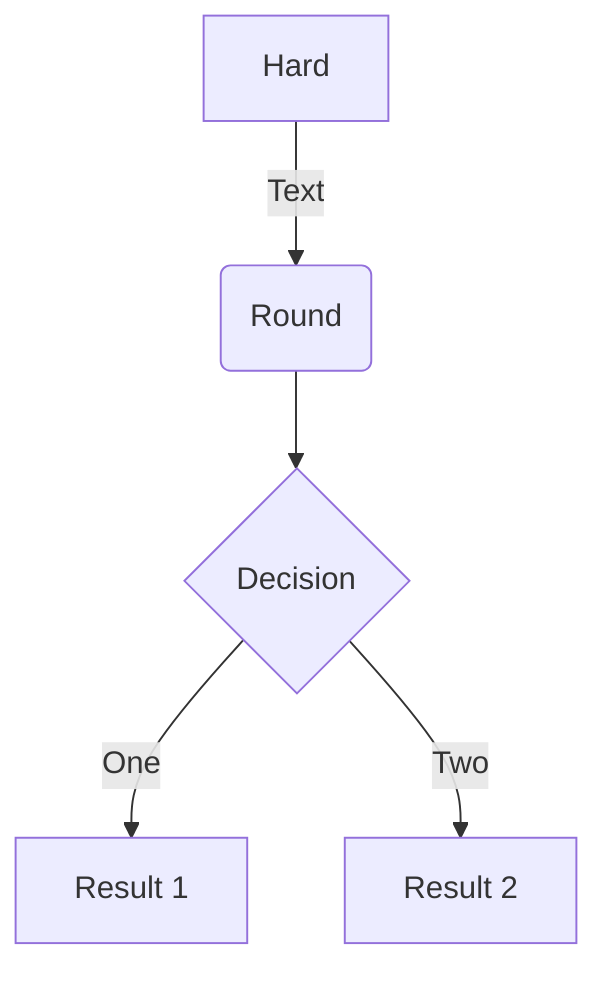
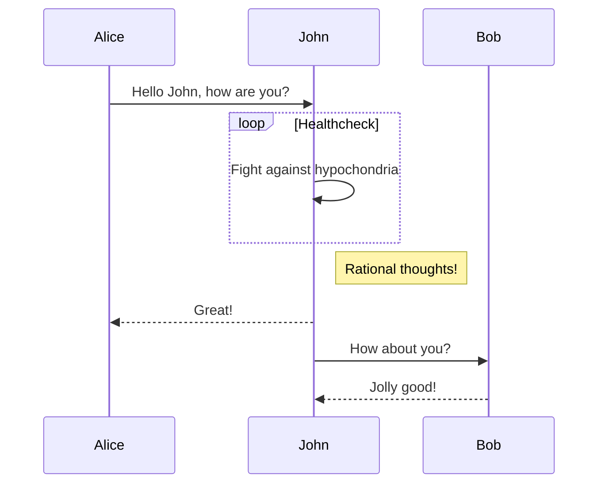
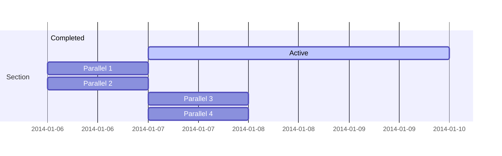
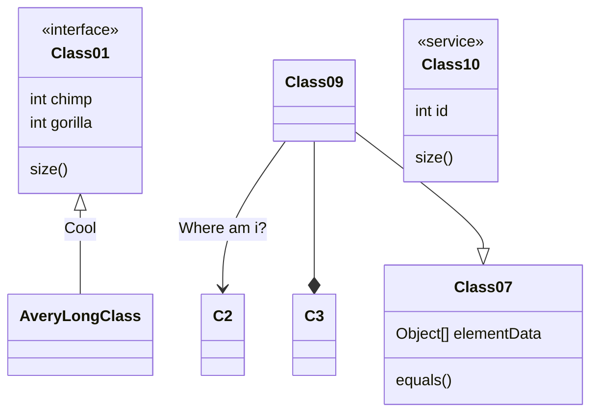
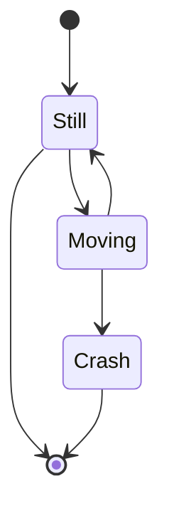

Academic is designed to give technical content creators a seamless experience. You can focus on the content and Academic handles the rest.

**Highlight your code snippets, take notes on math classes, and draw diagrams from textual representation.**

On this page, you'll find some examples of the types of technical content that can be rendered with Academic.

## Examples

### Code

Academic supports a Markdown extension for highlighting code syntax. You can enable this feature by toggling the `highlight` option in your `config/_default/params.toml` file.

    ```python
    import pandas as pd
    data = pd.read_csv("data.csv")
    data.head()
    ```

renders as

```python
import pandas as pd
data = pd.read_csv("data.csv")
data.head()
```

### Charts

Academic supports the popular [Plotly](https://plot.ly/) chart format.

Save your Plotly JSON in your page folder, for example `chart.json`, and then add the `` shortcode where you would like the chart to appear.

Demo:



You might also find the [Plotly JSON Editor](http://plotly-json-editor.getforge.io/) useful.

### Math

Academic supports a Markdown extension for $\LaTeX$ math. You can enable this feature by toggling the `math` option in your `config/_default/params.toml` file.

To render *inline* or *block* math, wrap your LaTeX math with `$...$` or `$$...$$`, respectively.

Example **math block**:
$$
 f(x)=\sum_{k=1}^n \binom{n}{k} x^k
$$

Ekspresi/persamaan matematika dapat ditulis di dalam baris teks (***inline*** di tengah kalimat/paragraf), untuk ekspresi matematika yang sederhana/singkat seperti $ax^2+bx+c=0$, atau pada baris tersendiri (***displayed***), untuk ekspresi matematika dan rumit/panjang/multibaris, seperti contoh berikut ini.  
$$
\sum_{i=0}^n i^2 = \frac{(n^2+n)(2n+1)}{6}
$$
Untuk menuliskan ekspresi matematika yang ditampilkan di dalam baris teks, perintah LaTeX diapit dengan tanda dolar tunggal (`$`), sedangkan untuk menampilkan ekspresi matematika pada baris tersendiri, perintah LaTeX diapit dengan tanda dolar dobel (`$$`[^(*)]). Berikut adalah beberapa contoh.

[^(*)]:  Beberapa aplikasi Markdown mengharuskan tanda `$$` ditulis di baris sebelum dan sesudah teks matematika.

Anda menulis sebagai berikut.
```latex
Fungsi *Gamma* didefinisikan sebagai
$$\Gamma(z) = \int_0^\infty t^{z-1}e^{-t}dt\,.$$
Fungsi tersebut memenuhi: $\Gamma(n) = (n-1)!\quad\forall n\in\mathbb N$. 

Akar persamaan kuadrat $ax^2+bx+c=0$ adalah 
$$ x_{1,2} = {-b \pm \sqrt{b^2-4ac} \over 2a}.$$
```
Hasilnya akan tampil sebagai berikut.
> Fungsi *Gamma* didefinisikan sebagai
>
> $$\Gamma(z) = \int_0^\infty t^{z-1}e^{-t}dt\,.$$
> Fungsi tersebut memenuhi: $\Gamma(n) = (n-1)!\quad\forall n\in\mathbb N$. 
>
> Akar persamaan kuadrat $ax^2+bx+c=0$ adalah: 
> $$x_{1,2} = {-b \pm \sqrt{b^2-4ac} \over 2a}.$$

Tabel berikut menyajikan beberapa contoh lain penulisan ekspresi matematika dengan LaTeX di dokumen Markdown.

| Penulisan LaTeX di Markdown|Tampilan hasilnya|
|----|:----:|
|`$\alpha,\ \beta,\ \gamma,\ \delta$`| $\alpha,\ \beta,\ \gamma,\ \delta$|
|`$\epsilon,\ \iota,\ \omega,\ ...,\ \kappa$`| $\epsilon,\ \iota,\ \omega,\ ...,\ \kappa$|
|`$\Delta,\ \Gamma,\ \Omega,\ ...,\ \chi$`| $\Delta,\ \Gamma,\ \Omega,\ ...,\ \chi$|
|`$\sum_{i=0}^n i^2 = \frac{(n^2+n)(2n+1)}{6}$`|$\sum_{i=0}^n i^2 = \frac{(n^2+n)(2n+1)}{6}$|
|`$$\sum_{i=0}^n i^2 = \frac{(n^2+n)(2n+1)}{6}$$`|$\displaystyle\sum_{i=0}^n i^2 = \frac{(n^2+n)(2n+1)}{6}$|
|`$(\frac{\sqrt x}{y^3})$`|$(\frac{\sqrt x}{y^3})$|
|`$$\left(\frac{\sqrt x}{y^3}\right)$$`|$$\left(\frac{\sqrt x}{y^3}\right)$$|
|`${n+1 \choose 2k}$` atau `$\binom{100}{15}$`|${n+1 \choose 2k}$ atau $\binom{100}{15}$|
|`$\begin{matrix} 1 & x & x^2\\ 1 & y & y^2 \\  1 & z & z^2 \\  \end{matrix}$`| $ \begin{matrix} 1 & x & x^2\\ 1 & y & y^2 \\  1 & z & z^2 \\  \end{matrix} $ |
|`$\begin{pmatrix} 1 & x & x^2\\ 1 & y & y^2 \\  1 & z & z^2 \\  \end{pmatrix}$`| $ \begin{pmatrix} 1 & x & x^2\\ 1 & y & y^2 \\  1 & z & z^2 \\  \end{pmatrix} $ |
|`$\sqrt[3]{\frac xy}$`|$\sqrt[3]{\frac xy}$|
|`$\lim\limits_{x\mapsto 1}\dfrac1x$`|$\lim\limits_{x\mapsto 1}\dfrac1x$|

Berikut adalah beberapa contoh lain penulisan ekspresi-ekspresi matematika yang lebih kompleks -- sekaligus menunjukkan kemampuan MathJax dalam memproses perintah-perintah LaTeX.
$$
\left[
\begin{array}{cc|c}
  1&2&3\\\
  4&5&6
\end{array}
\right]
$$
$$
\begin{pmatrix}
    a & b\\\
    c & d\\\
  \hline
    1 & 0\\\
    0 & 1
  \end{pmatrix}
$$

$$
\begin{aligned}
\sqrt{37} & = \sqrt{\frac{73^2-1}{12^2}} \\\
 & = \sqrt{\frac{73^2}{12^2}\cdot\frac{73^2-1}{73^2}} \\\ 
 & = \sqrt{\frac{73^2}{12^2}}\sqrt{\frac{73^2-1}{73^2}} \\\
 & = \frac{73}{12}\sqrt{1 - \frac{1}{73^2}} \\\ 
 & \approx \frac{73}{12}\left(1 - \frac{1}{2\cdot73^2}\right)
\end{aligned}
$$
Didefinisikan 
$$
f(n) =
\begin{cases}
n/2,  & \text{jika $n$ genap}, \\\\[1ex]
3n+1, & \text{jika $n$ ganjil}.
\end{cases}
$$
$$
\begin{array}{c|lcr}
n & \text{Rata kiri} & \text{Di tengah} & \text{Rata kanan} \\\
\hline
1 & 0.24 & 1 & 125 \\\
2 & -1 & 189 & -8 \\\
3 & -20 & 2000 & 1+10i
\end{array}
$$

$$
\left\\{\begin{array}{c}
a_1x+b_1y+c_1z=d_1 \\\\[1ex] 
a_2x+b_2y+c_2z=d_2 \\\\[1ex]
a_3x+b_3y+c_3z=d_3
\end{array}\right\.
$$

$$
\left\\{ \begin{array}{l} 
0 = c_x-a_{x0}-d_{x0}\dfrac{(c_x-a_{x0})\cdot d_{x0}}{\|d_{x0}\|^2} + c_x-a_{x1}-d_{x1}\dfrac{(c_x-a_{x1})\cdot d_{x1}}{\|d_{x1}\|^2} \\\\[2ex] 
0 = c_y-a_{y0}-d_{y0}\dfrac{(c_y-a_{y0})\cdot d_{y0}}{\|d_{y0}\|^2} + c_y-a_{y1}-d_{y1}\dfrac{(c_y-a_{y1})\cdot d_{y1}}{\|d_{y1}\|^2} \end{array} \right\.
$$

$$
\underset{j=1}{\overset{\infty}{\LARGE\mathrm K}}\frac{a_j}{b_j}=\cfrac{a_1}{b_1+\cfrac{a_2}{b_2+\cfrac{a_3}{b_3+\ddots}}}
$$
Tabel berikut menampilkan pembagian $\dfrac{x^3-6x^2+11x-6}{x-1}=x^2-5x+6$.

$$
\begin{array}{c|rrrr}
& x^3 & x^2 & x^1 & x^0\\\ 
& 1 & -6 & 11 & -6\\\ {\color{red}1} 
& \downarrow & 1 & -5 & 6\\\ \hline 
& 1 & -5 & 6 & |\phantom{-} {\color{blue}0} \end{array}
$$

Tabel berikut menampilkan pembagian $\dfrac{x^3-6x^2+11x-6}{x-1}=x^2-5x+6$.

$$
\begin{array}{rrrr|ll}
 x^3 & -6x^2 & +11x & -6 & x - 1 \\\ 
 -x^3 & +x^2 & & & x^2-5x+6 \\\ \hline 
 & -5x^2 & +11x & -6\\ 
 & \phantom{-}5x^2 & -5x & & & & \\\ \hline 
 & & +6x & -6 \\ & & -6x & +6 \\\ \hline 
 & & 0 & 0 \end{array}
$$

```latex
$$\gamma_n = \frac{\left| \left(\mathbf x_n - \mathbf x\_{n-1} \right)^T 
\left[\nabla F (\mathbf x_n) - \nabla F (\mathbf x\_{n-1}) \right] \right|}
{\left|\nabla F(\mathbf x_n) - \nabla F(\mathbf x\_{n-1}) \right|^2}$$
```

renders as

$$\gamma_n = \frac{\left| \left(\mathbf x_n - \mathbf x\_{n-1} \right)^T \left[\nabla F (\mathbf x_n) - \nabla F (\mathbf x\_{n-1}) \right] \right|}{\left|\nabla F(\mathbf x_n) - \nabla F(\mathbf x\_{n-1}) \right|^2}$$

Example **inline math** `$\nabla F(\mathbf x_n)$` renders as $\nabla F(\mathbf x_n)$.

Example **multi-line math** using the `\\\\` math linebreak:

```latex
$$f(k;p_{0}^{\*}) = \begin{cases}p_{0}^{\*} & \text{if }k=1, \\\\
1-p_{0}^{\*} & \text{if }k=0.\end{cases}$$
```

renders as

$$
f(k;p_0^{\*}) = \begin{cases}p_0^{\*} & \text{if }k=1, \\\\
1-p_0^{\*} & \text{if }k=0.\end{cases}
$$

### Diagrams

Academic supports a Markdown extension for diagrams. You can enable this feature by toggling the `diagram` option in your `config/_default/params.toml` file or by adding `diagram: true` to your page front matter.

An example **flowchart**:

    ```mermaid
    graph TD
    A[Hard] -->|Text| B(Round)
    B --> C{Decision}
    C -->|One| D[Result 1]
    C -->|Two| E[Result 2]
    ```

renders as



An example **sequence diagram**:

    ```mermaid
    sequenceDiagram
    Alice->>John: Hello John, how are you?
    loop Healthcheck
        John->>John: Fight against hypochondria
    end
    Note right of John: Rational thoughts!
    John-->>Alice: Great!
    John->>Bob: How about you?
    Bob-->>John: Jolly good!
    ```

renders as



An example **Gantt diagram**:

    ```mermaid
    gantt
    section Section
    Completed :done,    des1, 2014-01-06,2014-01-08
    Active        :active,  des2, 2014-01-07, 3d
    Parallel 1   :         des3, after des1, 1d
    Parallel 2   :         des4, after des1, 1d
    Parallel 3   :         des5, after des3, 1d
    Parallel 4   :         des6, after des4, 1d
    ```

renders as



An example **class diagram**:

    ```mermaid
    classDiagram
    Class01 <|-- AveryLongClass : Cool
    <<interface>> Class01
    Class09 --> C2 : Where am i?
    Class09 --* C3
    Class09 --|> Class07
    Class07 : equals()
    Class07 : Object[] elementData
    Class01 : size()
    Class01 : int chimp
    Class01 : int gorilla
    class Class10 {
      <<service>>
      int id
      size()
    }
    ```

renders as



An example **state diagram**:

    ```mermaid
    stateDiagram
    [*] --> Still
    Still --> [*]
    Still --> Moving
    Moving --> Still
    Moving --> Crash
    Crash --> [*]
    ```

renders as



### Todo lists

You can even write your todo lists in Academic too:

```markdown
- [x] Write math example
- [x] Write diagram example
- [ ] Do something else
```

renders as

- [x] Write math example
- [x] Write diagram example
- [ ] Do something else

### Tables

Represent your data in tables:

```markdown
| First Header  | Second Header |
| ------------- | ------------- |
| Content Cell  | Content Cell  |
| Content Cell  | Content Cell  |
```

renders as

| First Header  | Second Header |
| ------------- | ------------- |
| Content Cell  | Content Cell  |
| Content Cell  | Content Cell  |

### Callouts

Academic supports a [shortcode for callouts](https://wowchemy.com/docs/content/writing-markdown-latex/#callouts), also referred to as *asides*, *hints*, or *alerts*. By wrapping a paragraph in `{} ... {}`, it will render as an aside.

```markdown
{}
A Markdown aside is useful for displaying notices, hints, or definitions to your readers.
{}
```

renders as

{}
A Markdown aside is useful for displaying notices, hints, or definitions to your readers.
{}

### Spoilers

Add a spoiler to a page to reveal text, such as an answer to a question, after a button is clicked.

```markdown

You found me!

```

renders as

 You found me! 

### Icons

Academic enables you to use a wide range of [icons from _Font Awesome_ and _Academicons_](https://sourcethemes.com/academic/docs/page-builder/#icons) in addition to [emojis](https://sourcethemes.com/academic/docs/writing-markdown-latex/#emojis).

Here are some examples using the `icon` shortcode to render icons:

```markdown
 Terminal  
 Python  
 R
```

renders as

 Terminal  
 Python  
 R

### Did you find this page helpful? Consider sharing it 🙌
